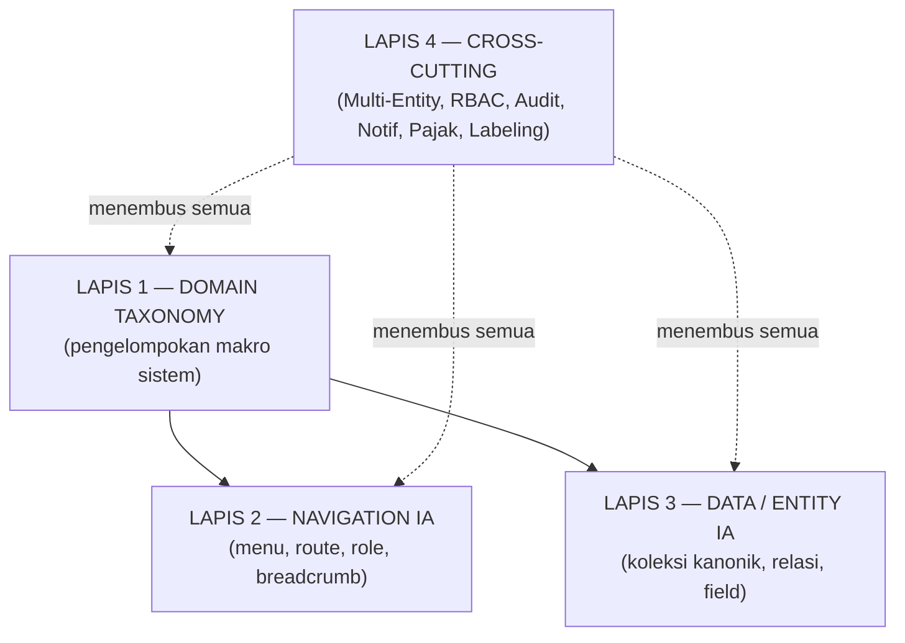
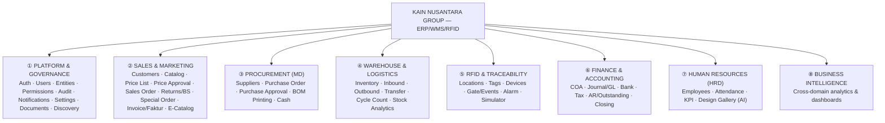
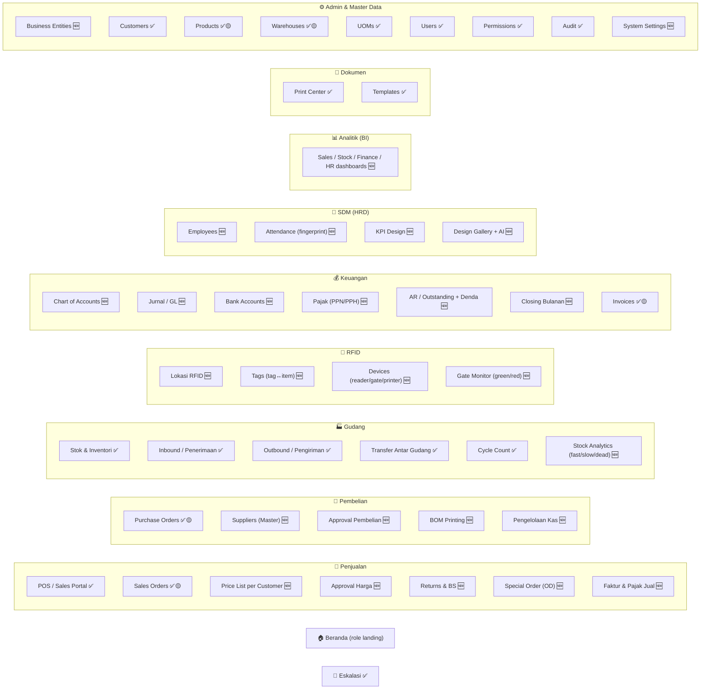
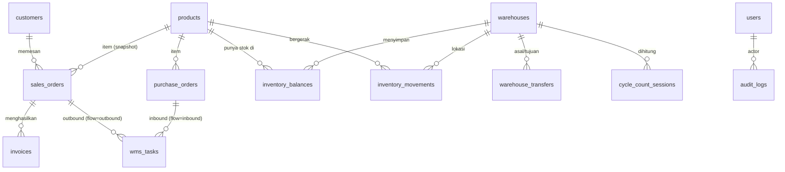
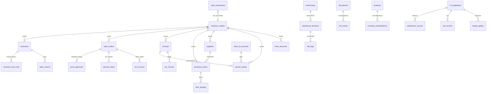
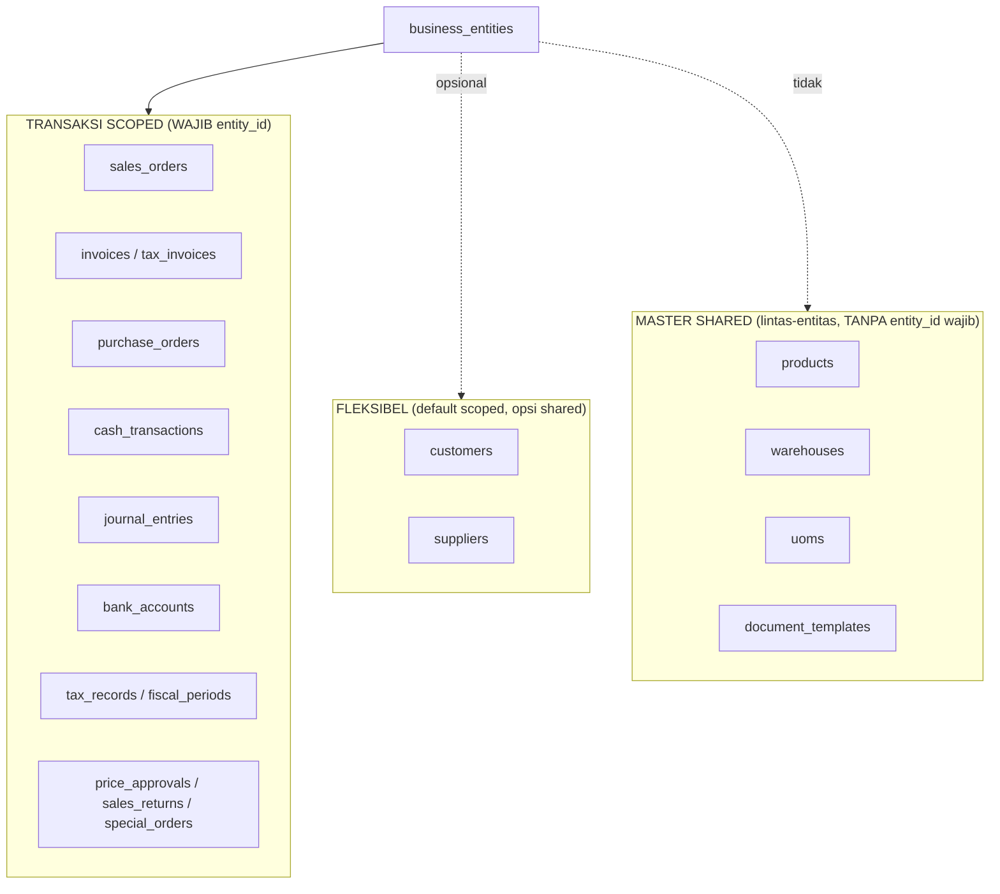

# KN_14 — INFORMATION ARCHITECTURE (IA) BLUEPRINT
## Kain Nusantara Group — ERP + WMS + RFID

> **Status:** DRAFT v1 (LIVING DOCUMENT — boleh di-update kapan saja sesuai case).
> **Disusun:** 15 Jun 2026 oleh E2 (Emergent), atas arahan user (Vendor IT).
> **Sifat:** Arsitektur/desain saja. **BELUM ADA CODING FITUR.** Dokumen ini adalah
> *fondasi* yang di-"colok" oleh seluruh fase roadmap (lihat `KN_DEVELOPMENT_PLAN_FROM_ASSESSMENT.md`).
> **Kanon turunan:** `KN_13_NAVIGATION_MAP.md` (IA navigasi) & `ENTITY_REGISTRY.md` (IA data)
> WAJIB tetap sinkron dengan dokumen ini. Bila berbeda → **kode yang menang**, lalu dokumen diperbaiki.

---

## 0. Cara Membaca Dokumen Ini

| Bagian | Isi |
|---|---|
| 1 | Tujuan & prinsip IA |
| 2 | Model 4-lapis IA |
| 3 | Potret As-Is (kondisi eksisting) |
| 4 | Domain Taxonomy (target) |
| 5 | **Navigation IA** (struktur menu/route/role lintas 6 fase) |
| 6 | **Data / Entity IA** (koleksi kanonik, relasi, ER diagram) |
| 7 | Lapis fundamental: **Multi-Entity** |
| 8 | Lapis fundamental: **Tax/Pajak** & **Notification** |
| 9 | Konvensi penamaan, prefix ID, nama terlarang |
| 10 | Cross-cutting concerns (RBAC, Audit, Labeling/Glosarium) |
| 11 | Phase → IA Delta Map (apa yang ditambah tiap fase) |
| 12 | Governance & change protocol (menjaga IA tetap hidup) |
| 13 | Keputusan terbuka |
| 14 | Changelog |

---

## 1. Tujuan & Prinsip IA

**Tujuan:** Menyediakan satu kerangka informasi yang **konsisten, scale-ready, dan anti-konflik**
agar 6 fase pengembangan bisa menempel tanpa drift data, menu redundan, atau rework arsitektur.

**Prinsip (NON-NEGOTIABLE):**
1. **SSOT** — satu entitas = satu koleksi kanonik. Tidak ada duplikat (lihat §9 nama terlarang).
2. **Code wins** — kontrak aktual menang atas prosa. Auth Bearer `sess_`+SHA256, response **array langsung**, prefix `/api`.
3. **Scale-ready navigation** — dari menu *flat* → *grouped domains*; kedalaman ≤ 4 level.
4. **Multi-Entity sebagai lapisan dasar** — dimodelkan sejak awal (implementasi bertahap).
5. **Separation of concerns** — Master data vs Transaksi vs Analitik vs Platform terpisah jelas.
6. **Guardrail-first** — setiap entitas/menu baru lewat `ENTITY_REGISTRY.md` + `KN_13` + gates sebelum "selesai".
7. **Bahasa** — komunikasi & label UI = **Bahasa Indonesia**; kode/koleksi/field = English snake_case.

---

## 2. Model 4-Lapis IA



- **Lapis 1** menentukan *bagaimana sistem dibagi* → memengaruhi grouping menu (Lapis 2) & namespace koleksi (Lapis 3).
- **Lapis 4** bukan modul, melainkan *concern* yang menembus semua (mis. `entity_id` ada di banyak koleksi; audit mencatat semua aksi).

---

## 3. Potret As-Is (Kondisi Eksisting — verified)

**Backend:** 23 router FastAPI · 22 koleksi kanonik MongoDB · auth Bearer `sess_` + SHA256.
**Frontend:** React 19 role-based, **menu FLAT** (single-level view switching).

**Menu flat saat ini (per role):**
```
Admin     : Admin · Dashboard · Sales POS · Orders · Purchasing · WMS · Eskalasi · Print Center
Manager   : Dashboard · Orders · Purchasing · WMS · Eskalasi · Print Center
Sales     : Sales POS · Orders · Print Center
Warehouse : WMS · Eskalasi · Print Center
```
**Modul Discovery** = web-app terpisah (route `/discovery/*`, tanpa login) — pola yang akan dipakai ulang untuk *Ecommerce Catalog publik*.

**Masalah IA eksisting:**
- Menu flat **tidak scale** untuk 6 fase (akan jadi 30+ item sejajar).
- Label tidak konsisten dengan KN_13 (mis. "WMS" vs "Warehouse & Operations").
- Belum ada lapisan **Multi-Entity**, **Notification**, dan namespace **Finance/HRD/RFID**.

**Kekuatan yang dipertahankan:** kontrak API stabil, ENTITY_REGISTRY disiplin, gates hijau (54/0/0, integrity 64/0/0).

---

## 4. Domain Taxonomy (Target)

Seluruh sistem dipetakan ke **8 domain makro**. Setiap entitas & menu WAJIB tinggal di salah satu domain.



| # | Domain | Status eksisting | Namespace koleksi |
|---|--------|------------------|-------------------|
| ① | Platform & Governance | ✅ sebagian (auth, users, permissions, audit, onboarding, documents, discovery) | users, sessions, permission_settings, audit_logs, document_templates, generated_documents, user_onboarding, discovery_* |
| ② | Sales & Marketing | 🟡 fondasi | customers, products, sales_orders, invoices |
| ③ | Procurement | 🟡 dasar | purchase_orders |
| ④ | Warehouse & Logistics | ✅ kuat | inventory_balances, inventory_movements, wms_tasks, warehouse_transfers, cycle_count_sessions, warehouses, uoms |
| ⑤ | RFID & Traceability | ❌ belum | *(planned)* |
| ⑥ | Finance & Accounting | 🟡 invoice simulated | invoices *(diperluas)* |
| ⑦ | Human Resources | ❌ belum | *(planned)* |
| ⑧ | Business Intelligence | 🟡 dasar | *(derived; dashboard/reporting)* |

---

## 5. Navigation IA (Target)

### 5.1 Global App Shell (Top Bar)

```
┌──────────────────────────────────────────────────────────────────────────┐
│ [≡] Kain Nusantara   [ Entity Switcher ▼ ]        [🔔 Notif] [❓ Help] [👤] │
└──────────────────────────────────────────────────────────────────────────┘
│ Sidebar (grouped, collapsible)        │  Konten (breadcrumb + tabs + panel) │
```
- **Entity Switcher (BARU):** konteks entitas aktif (PT Kain Suka Cita / CV Kanda Suka / "Semua"). Memfilter seluruh data transaksi. (Lapis Multi-Entity §7.)
- **Notification Center (BARU):** bell + dropdown (stok menipis, kedatangan, transfer, AR jatuh tempo, RFID alarm).
- **Help & Tours:** existing (role-based).
- **User Menu:** profil, ganti password (planned), logout.

### 5.2 Struktur Sidebar Bergrup (semua fase)

Tanda: ✅ ada · 🟡 enhancement · 🆕 [PLANNED] entitas/menu baru.



> **Katalog E-commerce publik** = route terpisah `/catalog/*` (read-only, tanpa login) — pola Discovery, **bukan** item sidebar internal.

### 5.3 Aturan Kedalaman (≤ 4 level)
```
L1 Grup domain (Penjualan)
 └ L2 Menu item (Sales Orders)
    └ L3 Tab / panel (Dashboard | List | Detail panel)
       └ L4 Modal (Edit item / Upload bukti)
```
**Anti-pattern (dilarang):** menu redundan lintas grup, halaman duplikat per-role (pakai 1 halaman conditional), nesting > 4.

### 5.4 Routing & URL Scheme (target)
```
Internal (auth):   /app/{domain}/{module}[?context]      mis. /app/sales/orders?status=approved
Standalone publik: /discovery/{session_id}  (existing)
                   /catalog[/{product_id}]  (planned, read-only)
Konteks entitas:   query/global state ?entity={entity_id}  (default: entitas aktif user)
```
> Frontend saat ini memakai *view-switching* (bukan react-router penuh). Migrasi ke routing bergrup = bagian Fase 0/1 (implementasi ditunda; IA-nya difinalkan di sini).

### 5.5 data-testid Convention (wajib elemen interaktif)
```
Sidebar grup     : nav-group-{domain}          (nav-group-sales)
Sidebar item     : nav-{module}                 (nav-orders, nav-suppliers)
Tab              : tab-{module}-{tab}           (tab-orders-list)
Entity switcher  : entity-switcher
Notification     : notif-bell · notif-item-{id}
Aksi             : btn-{action}-{module}        (btn-approve-price)
```

### 5.6 Role-Based Access Matrix (target, ringkas)

| Grup / Modul | Super/Sys Admin | Manager | Sales | Warehouse | Finance* | HRD* | Procurement* | Executive* |
|---|:--:|:--:|:--:|:--:|:--:|:--:|:--:|:--:|
| Beranda | ✅ | ✅ | ✅ | ✅ | ✅ | ✅ | ✅ | ✅(read) |
| Penjualan | ✅ | ✅ approve | ✅ | ❌ | 👁️ | ❌ | ❌ | 👁️ |
| Pembelian | ✅ | ✅ approve | ❌ | 👁️ | 👁️ | ❌ | ✅ | 👁️ |
| Gudang | ✅ | 👁️/approve | 👁️ | ✅ | 👁️ | ❌ | 👁️ | 👁️ |
| RFID | ✅ | 👁️ | ❌ | ✅ | ❌ | ❌ | ❌ | 👁️ |
| Keuangan | ✅ | 👁️ | ❌ | ❌ | ✅ | ❌ | 👁️ | 👁️ |
| SDM | ✅ | 👁️ | ❌ | ❌ | ❌ | ✅ | ❌ | 👁️ |
| Analitik (BI) | ✅ | ✅ | 👁️ | 👁️ | ✅ | 👁️ | 👁️ | ✅ |
| Dokumen | ✅ | ✅ | ✅ | ✅ | ✅ | 👁️ | ✅ | 👁️ |
| Admin & Master | ✅ | 👁️ | ❌ | ❌ | 👁️ | ❌ | ❌ | ❌ |
| Eskalasi | ✅ | ✅ | ❌ | ✅ | 👁️ | ❌ | 👁️ | 👁️ |

> *) Role baru (Finance/HRD/Procurement/Executive) = sesuai KN_01 Role Definitions. Saat ini sistem hanya punya `admin/sales/manager/warehouse`; perluasan role = bagian Fase terkait. RBAC sumber tunggal = `permission_settings` + `permissions_config.py` (hindari RC-9 dua sumber).

---

## 6. Data / Entity IA (Target)

### 6.1 Registry Koleksi (Eksisting + Planned)

**EKSISTING (22 kanonik — JANGAN duplikat):**
`users, sessions, products, customers, warehouses, uoms, sales_orders, invoices,
inventory_balances, inventory_movements, wms_tasks, warehouse_transfers,
cycle_count_sessions, purchase_orders, document_templates, generated_documents,
permission_settings, audit_logs, user_onboarding, discovery_sessions,
discovery_answers, discovery_attachments`

**PLANNED (per fase — detail di ENTITY_REGISTRY.md §Planned):**

| Domain | Koleksi baru | Fase |
|---|---|---|
| Platform | `business_entities`, `notifications` | 0 |
| Sales | `customer_price_lists`, `price_approvals`, `sales_returns`, `special_orders`, `tax_invoices` | 1 |
| Procurement | `suppliers`, `bom_printing`, `cash_transactions` | 3 |
| Finance | `chart_of_accounts`, `journal_entries`, `bank_accounts`, `tax_records`, `fiscal_periods` | 4 |
| Warehouse | `inventory_classifications` | 5 |
| Warehouse (Inventory Ownership) | `inventory_rolls` *(SSOT fisik; +`owner_entity_id` di balances/movements)* — **lihat KN_15** | 0.5 / 1 |
| RFID | `warehouse_locations`, `rfid_tags`, `rfid_devices`, `rfid_events` | 5 |
| HRD | `hr_employees`, `attendance_records`, `kpi_records`, `design_gallery` | 2 |

> **Catatan:** *Approval pembelian* dimodelkan sebagai **workflow state + attachment** pada `purchase_orders` (bukan koleksi baru) untuk hindari over-engineering; bila kebutuhan audit approval makin kompleks → pertimbangkan koleksi `approvals` generik (keputusan terbuka §13).

### 6.2 ER Diagram — Inti Eksisting (verified)



**Invarian wajib (di-enforce `verify_data_integrity.py`):**
- `inventory_balances.on_hand_qty == available + reserved + blocked + picked + in_transit` (no negatif).
- `sales_orders.total_amount == Σ items.subtotal`; `item.subtotal == price × quantity`.
- KPI dashboard == sumber data (`products`, Σ balances, `sales-orders`).

### 6.3 ER Diagram — Target dengan Multi-Entity + Planned (ringkas)



---

## 7. Lapis Fundamental #1 — Multi-Entity (dimodelkan sekarang, implementasi DITUNDA)

### 7.1 Master Entitas
```
Collection: business_entities          Prefix: ent_
Fields: id, legal_name, short_name, type(PT|CV), npwp, address, city,
        default_tax_mode(ppn|non_ppn), doc_prefixes{so,inv,po,faktur},
        logo_url, status(active|inactive), created_at, updated_at
Contoh: ent_ksc → "PT Kain Suka Cita" ; ent_kanda → "CV Kanda Suka"
```

### 7.2 Propagasi `entity_id` (aturan SHARED vs SCOPED)



**Default rekomendasi (bisa diubah):**
- **Master katalog & gudang = SHARED** (1 katalog & 1 jaringan gudang dipakai semua entitas).
- **Semua transaksi = SCOPED** (`entity_id` wajib; filter otomatis oleh Entity Switcher).
- **Customers & Suppliers = default SCOPED**, dengan opsi flag "shared" bila grup berbagi relasi.

> **⚠️ REVISI PENTING (KN_15 — Session #015):** keputusan user mengubah perlakuan **STOK**.
> Walau **katalog produk & definisi gudang tetap SHARED**, **kepemilikan stok TIDAK shared** — ia
> **scoped per entitas pada level ROLL** (`inventory_rolls.owner_entity_id`). Gudang bersifat **netral**
> (boleh menyimpan roll milik banyak entitas). `inventory_balances` jadi proyeksi dengan kunci
> `(product_id + warehouse_id + owner_entity_id)`. Penjualan owner-scoped; kekurangan stok antar-entitas
> diselesaikan via **inter-company transfer (wajib)**. **Detail penuh: `KN_15_INVENTORY_OWNERSHIP_LOT.md`.**

### 7.3 Nomor Dokumen per-Entitas
`doc_prefixes` di `business_entities` → series terpisah:
`KSC/SO/2026/00001`, `KANDA/INV/2026/00001`, dst. Dijaga gate **L5 number-series** (cegah duplikat — RC-5).

### 7.4 Migrasi / Backfill (saat implementasi)
- Buat entitas **"Default"** → backfill `entity_id` semua data lama.
- Wajib `verify_data_integrity.py` tetap **64/0/0** setelah backfill (no data rusak).
- Bersifat additive (tambah field) → aman terhadap kontrak existing.

---

## 8. Lapis Fundamental #2 & #3 — Tax & Notification

### 8.1 Tax / Pajak
- Flag `tax_mode` (ppn|non_ppn) berasal dari `business_entities` → override per `customers`/`sales_orders`.
- PPN 11% (configurable di System Settings). `tax_invoices` = faktur pajak (nomor, DPP, PPN, status).
- `tax_records` (Fase 4) = rekap PPN/PPH. **Coretax/e-Faktur** = integrasi DJP → fase lanjut (v1 cukup generate + export). *(keputusan terbuka §13)*

### 8.2 Notification Center
```
Collection: notifications               Prefix: ntf_
Fields: id, entity_id, recipient_role|recipient_user, type, title, body,
        link(navigation_target), severity(info|warning|critical),
        read(bool), created_at
Sumber event: stok menipis, kedatangan barang, transfer, AR jatuh tempo,
              dead stock, RFID gate RED.
```
- **v1 = polling/in-app** (cepat, tanpa infra). **v2 = WebSocket** (KN_05) saat Fase 5/RFID. *(keputusan terbuka §13)*

---

## 9. Konvensi Penamaan, Prefix ID, Nama Terlarang

### 9.1 Prefix ID (Eksisting + Planned — JANGAN bentrok)

| Prefix | Koleksi | Status |
|---|---|---|
| user_ | users | ✅ |
| sess_ | sessions | ✅ |
| prod_ | products | ✅ |
| cust_ | customers | ✅ |
| wh_ | warehouses | ✅ |
| uom_ | uoms | ✅ |
| so_ | sales_orders | ✅ |
| inv_ | invoices | ✅ |
| bal_ | inventory_balances | ✅ |
| mov_ | inventory_movements | ✅ |
| **roll_** | inventory_rolls *(PROPOSED KN_15 — SSOT fisik per roll)* | 🆕 |
| wms_ | wms_tasks | ✅ |
| trf_ | warehouse_transfers | ✅ |
| cc_ | cycle_count_sessions | ✅ |
| po_ | purchase_orders | ✅ |
| tmpl_ | document_templates | ✅ |
| doc_ | generated_documents | ✅ |
| audit_ | audit_logs | ✅ |
| addr_ | customer addresses (embedded) | ✅ |
| **ent_** | business_entities | 🆕 |
| **ntf_** | notifications | 🆕 |
| **cpl_** | customer_price_lists | 🆕 |
| **pra_** | price_approvals | 🆕 |
| **sret_** | sales_returns | 🆕 |
| **sord_** | special_orders | 🆕 |
| **fkt_** | tax_invoices (faktur) | 🆕 |
| **sup_** | suppliers | 🆕 |
| **bom_** | bom_printing | 🆕 |
| **cash_** | cash_transactions | 🆕 |
| **coa_** | chart_of_accounts | 🆕 |
| **je_** | journal_entries | 🆕 |
| **bank_** | bank_accounts | 🆕 |
| **tax_** | tax_records | 🆕 |
| **fper_** | fiscal_periods | 🆕 |
| **loc_** | warehouse_locations | 🆕 |
| **tag_** | rfid_tags | 🆕 |
| **dev_** | rfid_devices | 🆕 |
| **evt_** | rfid_events | 🆕 |
| **icls_** | inventory_classifications | 🆕 |
| **emp_** | hr_employees | 🆕 |
| **att_** | attendance_records | 🆕 |
| **kpi_** | kpi_records | 🆕 |
| **dsg_** | design_gallery | 🆕 |

### 9.2 Field standar (setiap dokumen baru)
`id, created_at, updated_at, created_by, created_by_name` + `entity_id` (bila scoped).

### 9.3 Nama TERLARANG (reference — lihat ENTITY_REGISTRY.md)
`items, goods, materials, kain, stock, stok, orders, penjualan, inbound_tasks,
outbound_tasks, transfers, po, pembelian, bills, tagihan, templates, staff, operator, gudang, depot`
**+ tambahan IA ini:** jangan buat `tenant`/`company` (gunakan `business_entities`), `ledger` lepas (gunakan `journal_entries`), `accounts` ambigu (gunakan `chart_of_accounts`/`bank_accounts`), `notif` (gunakan `notifications`).

> **⚠️ Temuan validasi guardrail (15 Jun):** `verify_contract.py` mendaftarkan
> **`employees`/`employee`/`staff`/`karyawan` sebagai alias TERLARANG → `users`**.
> Karena itu koleksi HRD memakai nama **`hr_employees`** (bukan `employees`) agar
> tidak memicu DRIFT RC-1. Demikian pula `stock_classifications` → **`inventory_classifications`**
> (konsistensi namespace `inventory_*`). Semua nama planned di dokumen ini SUDAH
> divalidasi terhadap `CANONICAL_COLLECTIONS` + `DANGEROUS_ALIASES` (exact-match).

---

## 10. Cross-Cutting Concerns

| Concern | Aturan IA |
|---|---|
| **RBAC** | Sumber tunggal `permission_settings` (+fallback `permissions_config.py`). Role baru ditambah di sini, bukan hardcode di FE (cegah RC-9). |
| **Audit** | `audit_logs` append-only via `audit()` helper. Semua aksi mutasi wajib tercatat. |
| **Multi-Entity** | Semua query transaksi WAJIB filter `entity_id` dari konteks (cegah kebocoran lintas-entitas). |
| **Notification** | Event bisnis → tulis `notifications` + `navigation_target` (klik → ke layar dgn konteks). |
| **Snapshot** | Denormalisasi nama (customer_name, product_name, warehouse_city) saat transaksi dibuat (cegah RC-6). |
| **Defensif render** | `.get()` + fallback untuk field display opsional; `safe_doc()` untuk serialisasi. |
| **Labeling/Glosarium** | Konsisten Bahasa Indonesia (lihat §10.1). |

### 10.1 Glosarium Label (Bahasa Indonesia — konsisten)
```
Sales Order → "Pesanan Penjualan (SO)"   | Purchase Order → "Pesanan Pembelian (PO)"
Invoice → "Faktur"                        | Faktur Pajak → "Faktur Pajak"
Inventory → "Stok / Inventori"            | Transfer → "Transfer Antar Gudang"
Outstanding → "Piutang (Outstanding)"     | Closing → "Tutup Buku"
Supplier → "Pemasok (Supplier)"           | Entity → "Entitas / Perusahaan"
Notification → "Notifikasi"               | Dead stock → "Stok Mati (>3 bln)"
```

---

## 11. Phase → IA Delta Map (apa yang ditambah tiap fase)

| Fase | Koleksi baru | Menu/Grup baru | Enhancement field | Cross-cutting |
|---|---|---|---|---|
| **0 Enabler** | business_entities, notifications | Entity Switcher, Notification Center, Admin→Entities | +entity_id (transaksi), customers(+npwp,credit_limit,sales_pic), products(+harga_pokok,gramasi) | Multi-Entity, Notif |
| **1 Sales** | customer_price_lists, price_approvals, sales_returns, special_orders, tax_invoices | Penjualan: Price List, Approval Harga, Returns/BS, Special Order, Faktur | sales_orders status lifecycle (Pending/Keep/Ready/Waiting Shipment/Partial/Complete) | Tax, credit-limit check |
| **3 Procurement** | suppliers, bom_printing, cash_transactions | Pembelian: Suppliers, Approval, BOM Printing, Kas | purchase_orders→suppliers (bukan string), toleransi ±2% receiving | approval workflow |
| **4 Finance** | chart_of_accounts, journal_entries, bank_accounts, tax_records, fiscal_periods | Keuangan: COA, Jurnal, Bank, Pajak, AR/Outstanding, Closing | invoices→AR aging+denda 1–3% | auto-posting, closing 28/30/31 |
| **5 Warehouse+RFID** | inventory_classifications, warehouse_locations, rfid_tags, rfid_devices, rfid_events | Gudang: Stock Analytics; RFID grup | warehouses: +Level (Zone→Rack→Level→Bin) | WebSocket real-time, gate green/red |
| **2 HRD** | hr_employees, attendance_records, kpi_records, design_gallery | SDM grup | — | AI Gemini (design) |
| **6 Additional** | by request | by request | — | — |
| **BI** | *(derived)* | Analitik grup | — | lintas-domain |

---

## 12. Governance & Change Protocol (menjaga IA tetap hidup)

**Dokumen ini LIVING — wajib di-update saat:** tambah entitas, menu, atau lapis cross-cutting.

**Protokol perubahan IA:**
1. Usulkan perubahan → tandai `[PROPOSED]` di sini.
2. Sinkronkan ke **KN_13** (navigasi) & **ENTITY_REGISTRY** (data) SEBELUM coding.
3. Tambah koleksi → daftarkan di `verify_contract.py` (CANONICAL) + `verify_data_integrity.py` (Concept/invarian) + `health_check.py` (endpoint kritis).
4. Setelah implementasi → gates HIJAU (compliance, ux_audit, contract, integrity, api_contract) → `testing_agent_v3` → baru "selesai".
5. Update changelog (§14) + `SESSION_HANDOFF.md`.

**Konsistensi 3-dokumen (SSOT triangle):**
```
KN_14 (IA induk) ─ menentukan ─▶ KN_13 (navigasi) + ENTITY_REGISTRY (data)
        ▲                                   │
        └──────── code wins (perbaiki doc) ─┘
```

---

## 13. Keputusan Terbuka (perlu input user — tidak memblok penyusunan IA)

> **✅ TERJAWAB (Session #015) — Multi-Entity Inventory Ownership (lihat KN_15):**
> - **D1** Kepemilikan stok melekat pada **roll**; **gudang netral/shared**. → *Disepakati.*
> - **D2** Kedalaman: **Roll-as-SSOT penuh** (`inventory_rolls`). → *Disepakati.*
> - **D3** Entitas A jual barang milik B → **wajib inter-company transfer dulu**. → *Disepakati.*
> - **D4** `unit_cost`/HPP per roll/lot → **dicatat di Fase 4** (field disiapkan nullable). → *Disepakati.*
> - **K1** Visibilitas Sales (gudang+owner+lot), **K2** integritas lot (single vs mixed), **K3** flow shortage→transfer
>   → didetailkan di KN_15. **Sub-keputusan S1–S8 (KN_15 §14) masih MENUNGGU konfirmasi.**

1. **Multi-Entity scope:** SHARED master (rekomendasi) vs SEPARATE per entitas? Berapa entitas legal awal?
2. **Customers/Suppliers:** scoped per entitas atau shared lintas grup?
3. **Tax:** v1 generate+export faktur (rekomendasi) vs wajib e-Faktur/Coretax otomatis (butuh kredensial DJP)?
4. **Real-time:** Notification Center (polling) dulu → WebSocket Fase 5 (rekomendasi) vs WebSocket sekarang?
5. **Approval workflow:** state+attachment pada dokumen (rekomendasi) vs koleksi `approvals` generik?
6. **RFID:** vendor & protokol (MQTT/HTTP)? Setuju buat **simulator** dulu untuk validasi alur tanpa hardware?
7. **HRD fingerprint:** import file (CSV) vs API/SDK mesin? Merek mesin?
8. **AI Gemini (design gallery):** setuju pakai Emergent LLM key (Gemini)?
9. **Routing FE:** migrasi view-switching → react-router bergrup di Fase 0/1?

---

## 14. Changelog

### v1.2 — Session #015 (Multi-Entity Inventory Ownership + Lot — DRAFT)
- **Keputusan user (D1–D4) diserap:** kepemilikan stok per-entitas pada **level roll** (`inventory_rolls` = SSOT
  fisik), **gudang netral/shared**, `inventory_balances` jadi proyeksi kunci `(product+warehouse+owner_entity)`,
  inter-company transfer **wajib** sebelum jual barang entitas lain, HPP (`unit_cost`) ditunda ke Fase 4.
- **Kebutuhan baru:** visibilitas Sales (gudang+owner+lot, K1), **integritas lot** single vs mixed (K2),
  **flow shortage→inter-company transfer** yang dipermudah (K3).
- **Dokumen baru:** `KN_15_INVENTORY_OWNERSHIP_LOT.md` (deep dive: model 3-lapis, algoritma alokasi
  owner+lot-aware, 28 edge case/blindspot, invarian gate baru, migrasi, phasing, sub-decision S1–S8).
- Sinkron: ENTITY_REGISTRY (inventory_rolls + revisi balances/movements/transfers + prefix roll_),
  §6.1/§7/§9.1/§13 KN_14, TECH_DECISIONS (ADR-008), plan.md (Fase 0.5).
- **Belum ada coding.** Status DRAFT — sub-keputusan S1–S8 menunggu konfirmasi user.

### v1.1 — 15 Jun 2026 (Fase 0 IMPLEMENTED)
- **Fase 0 (Enabler) selesai & tested:** `business_entities` (ent_ksc PT Kain Suka Cita, ent_kanda CV Kanda Suka) + `entity_id` scoped pada `sales_orders/invoices/purchase_orders/customers` (master `products/warehouses/uoms` tetap SHARED); `notifications` + Notification Center (generator REAL: low_stock/reservation_expiring/order_approval/order_split, dedupe by `ref`); Entity Switcher global (TopBar, persist localStorage); field master baru (customer `npwp/credit_limit/sales_pic`, product `harga_pokok/gramasi`); Admin "Entities" tab.
- **Temuan validasi:** `employees`→`hr_employees`, `stock_classifications`→`inventory_classifications` (lihat §9.3).
- Gates HIJAU: contract+api_contract+integrity 64/0/0, compliance 56/0/0, ux 0 ERROR, sweep 0×5xx. testing_agent: backend 39/39, frontend 100%.

### v1 — 15 Jun 2026 (Initial IA Blueprint)
- Dibuat dari `KN_DEVELOPMENT_PLAN_FROM_ASSESSMENT.md` + review/mapping sistem eksisting KN5.
- Definisi 4-lapis IA, 8 domain taxonomy, target grouped-navigation (6 fase), ER target + multi-entity layering, tax & notification layer, prefix ID & nama terlarang yang diperluas, governance protocol.
- **Belum ada coding.** Menunggu input keputusan terbuka §13 untuk eksekusi per-fase.

---
*SSOT triangle: KN_14 (IA) ⇄ KN_13 (navigasi) ⇄ ENTITY_REGISTRY (data). Selalu sinkron, code wins.*
