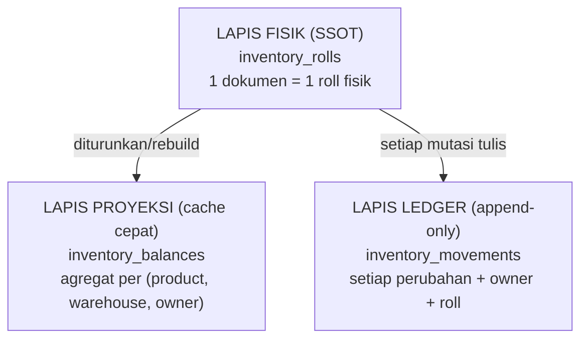
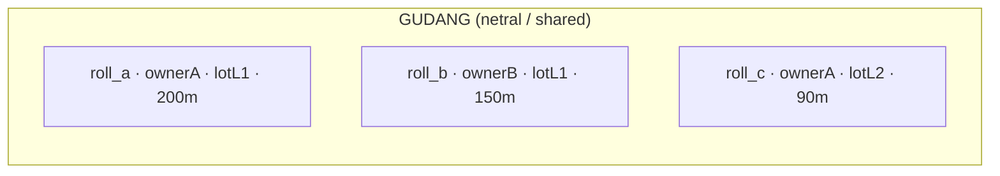
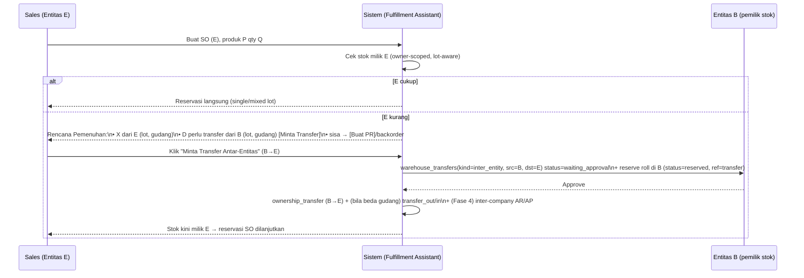
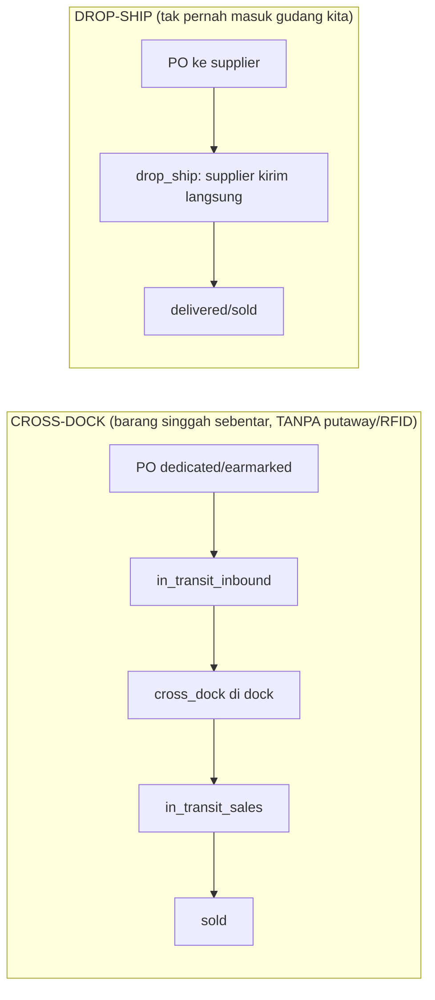

# KN_15 — MULTI-ENTITY INVENTORY OWNERSHIP & LOT INTEGRITY
## Kain Nusantara Group — Roll-as-SSOT Inventory Architecture (Deep Dive)

> **Status:** DRAFT v1.1 — *keputusan inti (D1–D4) + sub-keputusan (S1–S9) DISEPAKATI user (Session #015).
> Siap di-lock final & masuk implementasi Fase 0.5 saat user beri "GO". **BELUM ADA CODING FITUR.***
> **Disusun:** Session #015 oleh E2 (Emergent), atas arahan user (Vendor IT).
> **Induk:** `KN_14_INFORMATION_ARCHITECTURE.md` (IA). **Kanon data:** `ENTITY_REGISTRY.md`.
> **Sifat:** Deep-dive arsitektur kepemilikan stok per-entitas pada level **roll** + integritas **lot**
> + flow pemenuhan **lintas-entitas**. Dokumen ini "men-colok" Fase 1 (Sales) & Fase 5 (RFID).
> **Aturan emas:** bila dokumen ≠ kode → **kode menang**, lalu dokumen diperbaiki.

---

## 0. Cara Membaca

| § | Isi |
|---|---|
| 1 | Latar belakang + keputusan yang disepakati (D1–D4) |
| 2 | Prinsip & glosarium (roll, lot, owner, gudang netral) |
| 3 | Model data 3-lapis (rolls = SSOT, balances = proyeksi, movements = ledger) |
| 4 | Aturan kepemilikan (owner-scoped) & gudang netral |
| 5 | Aturan integritas LOT (single-lot vs mixed-lot) |
| 6 | Algoritma alokasi (hierarki prioritas + pseudocode) |
| 7 | Flow pemenuhan LINTAS-ENTITAS (shortage → inter-company transfer) |
| 8 | Visibilitas di Sales (warehouse + owner + lot) |
| 9 | Dampak ke modul eksisting (inbound/outbound/transfer/cycle/reservasi/dokumen/dashboard) |
| 10 | Dampak gate/guardrail (invarian baru + nama + prefix) |
| 11 | Migrasi / backfill data eksisting |
| 12 | **Edge cases / blindspots** (enumerasi lengkap) |
| 13 | Phasing implementasi |
| 14 | Keputusan terbuka (sub-decisions) |
| 15 | Changelog |

---

## 1. Latar Belakang & Keputusan yang Disepakati

Pada model Fase 0, stok diperlakukan **SHARED** dan `inventory_balances` unik per `(product_id, warehouse_id)`.
Kebutuhan bisnis nyata: **grup terdiri dari beberapa entitas legal** (PT Kain Suka Cita / CV Kanda Suka / dst),
dan **kepemilikan barang dipisah per entitas walau bisa disimpan di gudang yang sama**. Kain digulung
per **roll** dengan **lot** (dye-lot) yang menentukan keseragaman warna. Maka model inventory direvisi.

**Keputusan inti yang sudah DISEPAKATI user (Session #015):**

| # | Keputusan | Pilihan user |
|---|-----------|--------------|
| **D1** | Kepemilikan melekat pada **ROLL**; **gudang = lokasi fisik SHARED/netral** (bukan dimiliki entitas) | ✅ Setuju |
| **D2** | Kedalaman implementasi | ✅ **Opsi 2 — Roll-as-SSOT penuh** (`inventory_rolls`) |
| **D3** | Entitas A jual barang milik B → **wajib inter-company transfer (B→A) dulu** | ✅ Ya, wajib |
| **D4** | `unit_cost`/HPP per roll/lot | ⏸️ **Dicatat nanti di Fase 4** (field disiapkan, nullable sekarang) |

**Kebutuhan tambahan dari user (Session #015) — diakomodasi dokumen ini:**
- **K1** Di Sales, detail barang **harus jelas**: ada di **gudang mana**, **milik entitas siapa**, dan **lot** mana.
- **K2** **Integritas lot:** idealnya 1 pengiriman = **1 lot** (warna seragam). **Boleh lintas-lot HANYA jika** qty
  yang diminta **melebihi** kapasitas lot tunggal. Ini wajib menjadi **logic proses** (bukan sekadar imbauan).
- **K3** Jika qty pesanan **melebihi stok 1 entitas**, sistem harus **memandu** minta ke entitas lain (transfer)
  dengan **flow yang mempermudah** (bukan manual berbelit).

---

## 2. Prinsip & Glosarium

**Prinsip (NON-NEGOTIABLE untuk modul ini):**
1. **Roll = Single Source of Truth fisik.** Saldo (`balances`) hanya **proyeksi/cache** yang diturunkan dari rolls.
2. **Kepemilikan = dimensi kelas-satu** (`owner_entity_id`) yang melekat pada roll & ikut di setiap movement.
3. **Gudang netral** — gudang menyimpan roll milik entitas mana pun; kepemilikan TIDAK ditentukan oleh gudang.
4. **Owner adalah batasan KERAS untuk penjualan** — entitas hanya boleh menjual roll miliknya sendiri.
5. **Lot adalah batasan LUNAK** — diutamakan tunggal, boleh dilanggar **hanya** oleh aturan K2 + konfirmasi.
6. **Konservasi stok** — tidak ada stok "hilang/tercipta"; setiap perubahan = `inventory_movements` (append-only).
7. **Code wins**, gate menjaga invarian (lihat §10).

**Glosarium:**
```
Roll        : satu gulungan kain fisik (panjang aktual berbeda-beda — catch weight).
Lot         : dye-lot / batch pewarnaan. SKU sama, lot beda → warna BISA beda → tak boleh dicampur.
Batch       : batch produksi/pembelian (boleh = lot, boleh beda granularity).
Owner       : entitas legal pemilik roll (business_entities.id). 
Gudang netral: warehouse sebagai lokasi fisik bersama (boleh isi roll milik banyak entitas).
Segmen stok : kombinasi unik (product_id, warehouse_id, owner_entity_id) — unit agregasi balance.
Remnant (BS): sisa potongan roll setelah pemotongan sebagian (Barang Sisa).
Inter-company: transfer kepemilikan antar entitas = transaksi jual-beli internal (ada dampak akuntansi).
```

---

## 3. Model Data — 3 Lapis



### 3.1 `inventory_rolls` — SSOT fisik **(KOLEKSI BARU, prefix `roll_`)**
```
Collection: inventory_rolls            Prefix: roll_
Key bisnis: id (roll_xxx)              (1 dokumen = 1 roll fisik)
Fields:
  id                string   roll_<uuid>
  product_id        string   FK products (SKU/jenis kain) — SHARED katalog
  owner_entity_id   string   FK business_entities — KEPEMILIKAN (wajib utk internal)
  ownership_type    enum     internal | supplier_consignment | reseller_consignment
                             (DEFAULT internal; konsinyasi DISIAPKAN tapi default OFF — KN_16 G1)
  consignor_ref     object?  {type: supplier|customer, id, name}  (diisi bila konsinyasi; null bila internal)
  warehouse_id      string   FK warehouses — LOKASI gudang (netral)
  bin_id            string?  lokasi detail (Zone→Rack→[Level]→Bin); RFID-ready
  lot               string   dye-lot (WAJIB) — penentu warna
  batch             string?  batch produksi/pembelian
  roll_no           string?  nomor/serial roll fisik (label)
  length_initial    float    panjang awal aktual (measured saat receiving)
  length_remaining  float    sisa panjang aktual (≤ length_initial, ≥ 0)
  unit              string   base unit (meter|yard|...)
  grade             enum     A | A+ | B | C
  status            enum     (lihat §3.4 Taksonomi Status — siklus penuh)
                             on_order* | in_transit_inbound | receiving | quarantine |
                             available | reserved | committed | picked | packed |
                             cross_dock | in_transit_sales | sold |
                             in_transit_transfer | in_transit_intercompany |
                             blocked | damaged | returned | scrapped
                             (*on_order = pipeline PO, umumnya belum jadi roll)
  tracking_mode     enum     rfid | barcode | document | manual   (lihat §7B — stok visible TANPA RFID)
  earmarked_for     object?  {type: sales_order|special_order, id}  (pegging supply↔demand)
  location_type     enum     warehouse_bin | transit_in | transit_out | cross_dock |
                             drop_ship | transit_transfer | consignment  (lokasi virtual bila bukan di gudang)
  is_remnant        bool     true bila roll = sisa potongan (Barang Sisa / BS)
  reserved_ref      object?  {type: sales_order|transfer, id}  (siapa yang mengunci)
  unit_cost         float?   HPP per unit (NULLABLE — diisi Fase 4, D4)
  acquired          object   {via: po|transfer|initial|adjustment|return, ref_id, date}
  rfid_tag_id       string?  FK rfid_tags (Fase 5, nullable)
  created_at, updated_at, created_by, created_by_name
Index (saat coding):
  (product_id, owner_entity_id, status) · (lot) · (warehouse_id) · (rfid_tag_id) · (reserved_ref.id)
```
> ⚠️ Nama `inventory_rolls` konsisten namespace `inventory_*`. **JANGAN** pakai `stock`/`stock_units`/`rolls` lepas
> (lihat nama terlarang ENTITY_REGISTRY). Prefix ID `roll_`.

### 3.2 `inventory_balances` — proyeksi (REVISI key)
```
KEY UNIK LAMA : (product_id, warehouse_id)
KEY UNIK BARU : (product_id, warehouse_id, owner_entity_id)   ← tambah owner_entity_id
Fields (diturunkan dari rolls untuk segmen tsb):
  id (bal_), product_id, warehouse_id, owner_entity_id,
  --- BUCKET FISIK DI GUDANG (lihat §3.4) ---
  available_qty, reserved_qty, committed_qty, picked_qty, packed_qty,
  quarantine_qty, blocked_qty, damaged_qty,
  on_hand_qty (derived),
  --- BUCKET TRANSIT/PIPELINE (di luar gudang fisik, lihat §3.4) ---
  on_order_qty, in_transit_inbound_qty, in_transit_transfer_qty,
  in_transit_intercompany_qty, in_transit_sales_qty,
  --- DERIVED ---
  owned_qty, incoming_qty, atp_qty,
  updated_at
Aturan turunan (rebuild dari rolls segmen):
  available_qty   = Σ length_remaining (status=available)
  reserved_qty    = Σ length_remaining (status=reserved)
  committed_qty   = Σ length_remaining (status=committed)
  picked_qty      = Σ length_remaining (status=picked)
  packed_qty      = Σ length_remaining (status=packed)
  quarantine_qty  = Σ length_remaining (status=quarantine)
  blocked_qty     = Σ length_remaining (status=blocked)
  damaged_qty     = Σ length_remaining (status=damaged)
  on_hand_qty     = available+reserved+committed+picked+packed+quarantine+blocked+damaged  (FISIK di gudang ini)
  in_transit_*_qty= Σ length_remaining (status=in_transit_inbound|_transfer|_intercompany|_sales)
  on_order_qty    = dari purchase_orders (pipeline; belum jadi roll)
  owned_qty       = on_hand + in_transit_inbound + in_transit_transfer + in_transit_intercompany + in_transit_sales
  incoming_qty    = on_order + in_transit_inbound
  atp_qty         = available + incoming(horizon) − reserved_future   (Available To Promise)
```
> Balance TIDAK menyimpan lot (lot tetap di rolls). Ketersediaan **per-lot** dihitung on-demand dari rolls
> (group by lot) saat alokasi (§6). Balance = untuk KPI & cek cepat per segmen.

### 3.3 `inventory_movements` — ledger (REVISI: +owner +roll +lot)
```
Tambahan field WAJIB: owner_entity_id, roll_id, lot
Tipe movement (diperluas):
  initial_stock | inbound_receiving | outbound_dispatch |
  reservation | release_reservation |
  transfer_out | transfer_in |                         ← fisik, OWNER TETAP (intra-entitas)
  ownership_transfer_out | ownership_transfer_in |     ← OWNER BERUBAH (inter-company)
  cycle_count_adjustment | remnant_created |
  quarantine_in | quarantine_out | scrap
Untuk ownership_transfer: catat from_owner_entity_id & to_owner_entity_id.
Append-only (tak pernah update/delete).
```

---

## 3.4 Taksonomi Status Inventory (Pemetaan Detail — bukan "qty sederhana")

> Permintaan user: qty inventory **jangan satu angka** — harus ter-breakdown per status sepanjang
> siklus hidup (termasuk **barang dalam perjalanan**: beli masuk, transfer, dan **dikirim ke customer/transit sales**).
> Tujuan: **visibilitas penuh**. Kebenaran tetap di `inventory_rolls.status`; balance mengagregasi jadi bucket.

### 3.4.1 State Machine Roll (siklus penuh)

```mermaid
stateDiagram-v2
    [*] --> on_order : PO dibuat (pipeline; blm fisik)
    on_order --> in_transit_inbound : Supplier kirim (goods-in-transit BELI)
    in_transit_inbound --> receiving : Tiba di gudang
    receiving --> quarantine : QC hold (opsional)
    receiving --> available : Langsung lolos
    quarantine --> available : QC pass
    quarantine --> damaged : QC gagal
    available --> reserved : Dikunci SO (soft)
    reserved --> committed : Order approved (hard commit)
    committed --> picked : Dipick dari bin
    picked --> packed : Dikemas
    packed --> in_transit_sales : Dispatch ke customer (TRANSIT SALES)
    in_transit_sales --> sold : POD diterima (title pindah → keluar inventory)
    available --> in_transit_transfer : Transfer antar gudang (owner tetap)
    in_transit_transfer --> available : Diterima gudang tujuan
    available --> in_transit_intercompany : Inter-company (owner pindah saat dispatch)
    in_transit_intercompany --> available : Diterima entitas pembeli
    available --> blocked : Hold administratif
    in_transit_sales --> returned : Retur customer
    returned --> available : Disposisi: layak jual
    returned --> damaged : Disposisi: BS/rusak
    damaged --> scrapped : Write-off
```


### 3.4.2 Bucket Quantity — DI GUDANG FISIK (per product × warehouse × owner)
| Bucket | Arti | Bisa dijual? |
|---|---|---|
| `available_qty` | Bebas, siap jual | ✅ |
| `reserved_qty` | Dikunci SO (soft, masih di gudang) | ❌ (sudah dipesan) |
| `committed_qty` | Hard-commit pasca approve | ❌ |
| `picked_qty` | Sudah dipick/staging | ❌ |
| `packed_qty` | Sudah dikemas, siap kirim | ❌ |
| `quarantine_qty` | QC hold | ❌ (belum lolos) |
| `blocked_qty` | Hold administratif | ❌ |
| `damaged_qty` | Rusak, menunggu write-off | ❌ |
| **`on_hand_qty`** (derived) | **Total fisik di gudang ini** = Σ semua di atas | — |

### 3.4.3 Bucket Quantity — TRANSIT & PIPELINE (di luar gudang fisik; per product × owner)
| Bucket | Arti (jawaban permintaan user) | Lokasi virtual |
|---|---|---|
| `on_order_qty` | PO dibuat, supplier **belum** kirim (pipeline beli) | — (dari `purchase_orders`) |
| `in_transit_inbound_qty` | Supplier **sudah kirim**, barang menuju gudang (**barang dikirimkan — beli**) | "Transit Masuk" |
| `in_transit_transfer_qty` | Pindah antar gudang **sendiri** (intra-entitas) | "Transit Transfer" |
| `in_transit_intercompany_qty` | Pindah **antar entitas** (owner sudah pindah saat dispatch) | "Transit Antar-Entitas" |
| `in_transit_sales_qty` | **Sudah dispatch ke customer**, dalam pengiriman, pending POD (**transit sales**) | "Transit Sales" |
| `cross_dock_qty` | Barang earmarked di dock, menunggu **langsung kirim** (tanpa putaway/RFID) | "Cross-Dock" |
| `drop_ship_qty` | Barang supplier→customer langsung (tak pernah di gudang kita) | "Drop-Ship" |

### 3.4.4 Angka Turunan (untuk visibilitas & janji ke customer)
```
owned_qty   = on_hand + in_transit_inbound + in_transit_transfer + in_transit_intercompany + in_transit_sales
              (TOTAL milik entitas, di mana pun — sampai title pindah ke customer)
incoming_qty= on_order + in_transit_inbound                        (total diharapkan tiba)
ATP_qty     = available + incoming(dalam horizon waktu) − reserved (Available To Promise — janji jual aman)
```

### 3.4.5 "Inventory Status Board" (UI clarity)
Untuk setiap produk (dan per entitas) tampilkan papan status: kolom = bucket di atas; baris bisa
di-drill ke (gudang × lot × roll). Label **Bahasa Indonesia** konsisten (lihat §9 glosarium label).
Inilah yang membuat inventory **jelas**, bukan satu angka ambigu.

> **Catatan akuntansi (Fase 4):** `sold` keluar dari inventory (COGS). `in_transit_sales` masih aset
> sampai title pindah (tergantung Incoterms/POD). `in_transit_inbound` sudah aset pembeli (goods-in-transit).
> Detail posting = ADR-008 / Fase 4.

---

## 4. Aturan Kepemilikan & Gudang Netral (D1)


- **Satu gudang** boleh menyimpan roll milik **banyak entitas** sekaligus.
- **SKU sama** bisa tersebar: gudang berbeda + owner berbeda + lot berbeda (sesuai pernyataan user).
- `warehouses` **tetap SHARED** (definisi lokasi), boleh ada field opsional `managing_entity_id`
  hanya untuk **alokasi biaya sewa/operasional** (BUKAN kepemilikan stok). *(sub-decision §14-S6)*
- **Penjualan owner-scoped:** SO punya `entity_id` (entitas penjual). Reservasi/alokasi **hanya** boleh
  mengambil roll dengan `owner_entity_id == SO.entity_id`. Kurang → §7 (inter-company).

---

## 5. Aturan Integritas LOT (K2)

> Tujuan: keseragaman warna. **1 pengiriman idealnya 1 lot.** Lintas-lot hanya bila qty melebihi lot tunggal.

**Aturan (di-enforce sebagai logic proses):**
- **R1 — Single-Lot Preference (default):** pemenuhan 1 baris order DIUTAMAKAN dari **satu lot**.
- **R2 — Multi-Lot Exception:** jika qty diminta **> qty tersedia pada lot tunggal terbesar** (milik entitas
  penjual, setelah inter-company bila perlu), maka **boleh lintas-lot**. Sistem **WAJIB**:
  - menandai baris order `lot_mode = "mixed"` + daftar lot yang dipakai,
  - menampilkan **peringatan + minta konfirmasi eksplisit** ("Qty melebihi 1 lot. Pengiriman akan tercampur
    lot L1 + L2. Lanjutkan?"),
  - mencatat siapa yang mengonfirmasi (audit).
- **R3 — Lot Selection Policy (bila ada >1 lot tunggal yang cukup):** default **FEFO/FIFO (lot tertua dulu)**
  untuk menekan aging. Opsi alternatif "smallest-fit" (habiskan lot kecil dulu) = config. *(sub-decision §14-S1)*
- **R4 — Customer Lot Policy:** field `lot_policy` di customer/order:
  - `strict_single` → tidak boleh mixed; bila qty > lot tunggal → **pecah jadi beberapa shipment per-lot**
    atau backorder (sesuai pilihan), tidak pernah mencampur dalam 1 surat jalan.
  - `prefer_single` (default) → ikuti R1+R2.
  - `allow_mixed` → boleh campur tanpa konfirmasi keras (tetap tercatat).

**Catatan penting (blindspot):** "1 lot" dan "1 gudang" bisa **berbenturan** (lot tunggal tersebar di 2 gudang,
atau lot tunggal milik 2 entitas). Prioritas konflik di §6 (Owner > Lot > Lokasi).

---

## 6. Algoritma Alokasi (Owner-aware + Lot-aware + Multi-source)

### 6.0 Allocation Policy — CONFIGURABLE + CLARITY (keputusan user Session #015)

> User: *"bisa beberapa pendekatan ini namun bisa juga custom oleh user, jadi fleksibel; yang penting clarity."*
> → Alokasi BUKAN hard-coded. Ada **objek kebijakan** (default sistem) yang bisa **di-override** per
> customer / per order, plus **mode manual** (user memilih sendiri) — dan hasil alokasi WAJIB **dijelaskan**.

```
allocation_policy = {
  mode:            "auto" | "assisted" | "manual",      # auto=sistem putuskan; assisted=usul+boleh edit; manual=user pilih
  priority_order:  ["owner","lot","location","roll_efficiency"],   # DAPAT DIURUT ULANG (drag) — owner selalu HARD #1
  lot_mode:        "prefer_single" | "strict_single" | "allow_mixed",   # default prefer_single
  lot_selection:   "fefo" | "fifo" | "smallest_fit" | "largest_fit",    # default fefo
  location_pref:   "nearest_customer" | "single_warehouse" | "fewest_splits",
  allow_intercompany: true,                              # boleh sumber dari entitas lain (via transfer)
  allow_partial:      true                               # boleh pemenuhan parsial + backorder
}
Tingkat berlaku (override hierarki): order > customer > system-settings (default).
```

**CLARITY (wajib):** setiap hasil alokasi mengembalikan **`allocation_explanation`** per sub-alokasi, mis.:
> *"30m dari Lot L1 (FEFO) · Gudang Bandung · milik PT KSC — alasan: lot tunggal cukup, gudang terdekat ke Denpasar."*
> *"20m perlu transfer dari CV Kanda (Lot L1, Gudang Jakarta) — alasan: stok PT KSC kurang 20m."*

**MANUAL OVERRIDE (wajib):** di mode `manual`/`assisted`, user dapat mengganti pilihan **lot / gudang / roll**
dengan **rekomputasi langsung** (cek ketersediaan + peringatan bila melanggar lot/owner). Semua override **teraudit**.

### 6.1 Hierarki prioritas (default — dapat dikonfigurasi via `priority_order`)
```
1) OWNER          (HARD, tak bisa diubah) → hanya roll milik entitas penjual; kurang → inter-company (§7)
2) LOT consistency(SOFT)  → utamakan 1 lot; override hanya oleh R2 (qty > lot tunggal)
3) LOKASI         (SOFT)  → utamakan 1 gudang / terdekat ke kota customer (kurangi split & ongkir)
4) ROLL efficiency(SOFT)  → minimalkan jumlah roll dipotong, FEFO, minimalkan remnant
```
> Default user-intent: **Lot > Lokasi** (warna lebih penting dari ongkir). **Bisa dibalik** lewat `priority_order`
> (kecuali OWNER selalu #1). Lihat §14-S2 (resolved: configurable).

**Pseudocode (1 baris order: product P, qty Q, selling entity E, kota C):**
```
policy = resolve_policy(order, customer, system)        # override hierarki
rolls = inventory_rolls(P, owner=E, status=available)
by_lot = group(rolls, key=lot) ; per_lot_available = Σ length_remaining

# Langkah 1 — satu lot cukup (kasus ideal)
lots_cukup = [lot for lot in by_lot if per_lot_available[lot] >= Q]
if lots_cukup:
    lot = pilih(lots_cukup, policy=R3)                 # FEFO/FIFO atau smallest-fit
    rolls_terpilih = pilih_rolls(by_lot[lot], Q,       # prioritas: 1 gudang, FEFO, minimal potong
                                 prefer_warehouse_near(C))
    return Alokasi(single_lot=lot, rolls=rolls_terpilih)   # DONE

# Langkah 2 — tak ada lot tunggal cukup, TAPI total milik E cukup → MIXED LOT (R2)
if Σ per_lot_available >= Q:
    rolls_terpilih = ambil_lintas_lot(by_lot, Q, order=FEFO)   # tandai lot_mode=mixed
    return Alokasi(mixed_lot=daftar_lot, rolls=rolls_terpilih, butuh_konfirmasi=True)

# Langkah 3 — milik E tidak cukup → INTER-COMPANY (§7)
deficit = Q - Σ per_lot_available
sumber_lain = inventory_rolls(P, owner!=E, status=available)
                .prioritas(lot_sama_dengan_alokasi_E, lalu single-lot, lalu gudang terdekat)
rencana_transfer = susun_inter_company(deficit, sumber_lain)   # B→E (butuh approval B)
return RencanaPemenuhan(own=alokasi_E_parsial,
                        inter_company=rencana_transfer,
                        butuh_konfirmasi=True)

# Langkah 4 — tidak ada entitas pun cukup → backorder / PR pembelian / special order
return RencanaPemenuhan(kurang=sisa, opsi=[backorder, buat_PR, special_order, partial])
```

**Reservasi atomik level-roll (cegah double-booking):**
```
find_one_and_update(inventory_rolls,
   filter={id: roll_id, status: "available"},
   update={status:"reserved", reserved_ref:{type:"sales_order", id: SO}})
→ bila gagal (None) artinya roll keburu diambil order lain → retry/pilih roll lain.
Setelah commit semua roll → rebuild balance segmen (atomic recompute).
```

---

## 7. Flow Pemenuhan LINTAS-ENTITAS (K3 + D3)

> Bila entitas penjual (E) kurang, sistem **memandu** pengambilan dari entitas lain (B) via **inter-company transfer**.
> **Wajib** (D3): tidak boleh menjual barang milik B tanpa transfer kepemilikan dulu.



**Aturan & governance inter-company:**
- **Persetujuan sumber wajib:** entitas B harus approve sebelum kepemilikan pindah (RBAC: manager/owner B).
- **Reservasi selama menunggu:** roll di B di-`reserved` (ref=transfer) agar tidak dijual ganda oleh B.
- **Waktu pindah kepemilikan** (sub-decision §14-S3): default **saat approval/dispatch** → in_transit sudah
  `owner=E`. Alternatif: pindah saat **diterima** (lebih konservatif).
- **Harga transfer (transfer price)** & dampak buku (revenue B, persediaan E, eliminasi konsolidasi) = **Fase 4**
  (D4). Sekarang cukup catat `transfer_price?` nullable + jejak audit.
- **Penolakan B:** fallback otomatis → tawarkan entitas lain / buat PR / partial / backorder.
- **Model koleksi:** **EXTEND `warehouse_transfers`** (bukan koleksi baru) dengan:
  `transfer_kind (intra_entity|inter_entity)`, `source_entity_id`, `dest_entity_id`, `transfer_price?`,
  `linked_order_id?` (SO pemicu). Hindari duplikat koleksi (SSOT). *(sub-decision §14-S4)*

**3 jenis transfer (rangkuman):**
| Kasus | Fisik pindah? | Owner berubah? | Movement |
|---|---|---|---|
| Sama entitas, beda gudang | ✅ | ❌ | transfer_out + transfer_in |
| Beda entitas, gudang sama | ❌ | ✅ | ownership_transfer_out + _in |
| Beda entitas, beda gudang | ✅ | ✅ | ownership_transfer + transfer_out/in |

---

## 7B. Mode Sumber/Pemenuhan, Tracking Multi-Modal & Cross-Dock/Drop-Ship (Session #015)

> Penegasan user: **order tidak selalu dari stok on-hand**, dan **tracking ≠ RFID saja**. Sebagian barang
> (dibeli khusus untuk order) **tak perlu masuk gudang & tak perlu RFID** — langsung transit → kirim.
> Maka inventory dilacak by **STATUS + dokumen**, bukan hanya qty/RFID.

### 7B.1 Mode Sumber/Pemenuhan per baris SO (`fulfillment_mode`)
| Mode | Sumber barang | Masuk gudang (putaway)? | Perlu RFID? | Status SO terkait |
|---|---|---|---|---|
| `from_stock` (MTS) | roll **on-hand available** | ✅ sudah di gudang | ✅ (rfid/barcode) | reserved→committed→… |
| `from_incoming` (ATP/pre-order) | **on_order / in_transit_inbound** (PO sudah ada) | tergantung | tergantung | `backorder`→fulfillable |
| `buy_to_order` (MTO) | **PR/PO dedicated** dibuat utk order ini | tergantung | tergantung | `waiting_procurement` |
| `special_order` | **SKU belum ada** → MD buat produk + procure | tergantung | tergantung | `special_request`→… |
| `cross_dock` | barang earmarked, **masuk → langsung kirim** | ❌ **bypass storage** | ❌ **bypass RFID** | `cross_dock`→shipped |
| `drop_ship` | supplier **kirim LANGSUNG ke customer** | ❌ tak pernah di gudang | ❌ | `drop_ship`→delivered |
| `inter_company` | stok **entitas lain** (transfer) | tergantung | tergantung | `waiting_intercompany` |

> Satu SO bisa **campuran mode** per baris (komposit): mis. 60m from_stock + 40m cross_dock.

### 7B.2 Tracking Multi-Modal (stok VISIBLE tanpa RFID)
> RFID hanyalah **salah satu** mekanisme tracking (untuk barang yang fisik tersimpan & di-putaway).
```
rfid     : tag fisik per roll (gudang, putaway) — Fase 5. Untuk barang DISIMPAN.
barcode  : scan barcode/QR tanpa RFID.
document : dilacak via DOKUMEN + STATUS (PO/SO/transfer) TANPA scan fisik —
           dipakai untuk: on_order, in_transit_*, cross_dock, drop_ship. ← INI yang bikin stok
           tetap terlihat walau belum/ tak pernah ada RFID.
manual   : input manual (count/adjustment).
```
**Implikasi:** "stok terlihat" ditentukan oleh **status + tracking_mode**, BUKAN keberadaan tag RFID.
Barang cross-dock/drop-ship/in-transit tetap masuk laporan inventory (bucket transit) walau `tracking_mode=document`.

### 7B.3 Lokasi Virtual (bukan bin gudang)
```
transit_in       : barang beli dalam perjalanan masuk (in_transit_inbound)
transit_out      : barang jual dalam pengiriman (in_transit_sales / "transit sales")
cross_dock       : barang earmarked menunggu langsung kirim (TIDAK di-putaway, TIDAK RFID)
drop_ship        : barang supplier→customer langsung (tak pernah fisik di kita)
transit_transfer : antar gudang / antar entitas
```
`roll.location_type` menandai ini bila `warehouse_id` tak relevan (atau hanya sebagai tujuan/asal).

### 7B.4 Cross-Dock vs Drop-Ship (skenario kunci user)

- **Cross-dock:** barang fisik singgah di dock kita lalu langsung dikirim ke customer. **Tidak** putaway ke bin,
  **tidak** print RFID, **tidak** pick dari rak. Hemat proses untuk barang beli-untuk-order.
- **Drop-ship:** supplier mengirim langsung ke customer; barang **tak pernah** ada di gudang kita.
  Tetap tercatat (status `drop_ship`, tracking `document`) untuk visibilitas, faktur, & dampak buku (Fase 4).

### 7B.5 Pegging / Earmarking (kunci supply ↔ demand)
```
roll.earmarked_for                          = {type: sales_order|special_order, id}
purchase_orders.items[].earmarked_for_order_id
sales_orders.items[].fulfillment_mode + supply_ref (PO/roll yang nge-peg)
```
→ Barang yang **dibeli khusus** untuk order tertentu dikunci sejak `on_order`, tak bisa "dicuri" order lain.

### 7B.6 Special Order (SKU belum ada) → request MD/Purchasing
```
Sales: buat Special Order (sord_) [deskripsi custom / SKU belum ada]
  → Request MD: buat product (atau non-stock item) di katalog
  → Request Purchasing: PR → PO (suppliers)  [earmarked_for_order_id]
  → Barang datang → cross_dock (atau putaway) → kirim
Status SO: special_request → md_review → procurement → in_transit → ready → shipped
```

### 7B.7 Pre-Order / PO-Order (stok belum on-hand tapi sudah/akan dipesan)
```
SO baris from_incoming:
  - cek ATP = available + incoming(horizon) − reserved   (horizon CONFIGURABLE)
  - reserve terhadap incoming (peg ke PO/in_transit_inbound)
  - SO status: backorder/waiting_stock → saat barang tiba → fulfillable (putaway ATAU cross_dock)
```

### 7B.8 Verifikasi logic yang Anda tanyakan
- ✅ **Stock in transfer** — SUDAH ada di taksonomi (§3.4): `in_transit_transfer_qty` (antar gudang sendiri)
  & `in_transit_intercompany_qty` (antar entitas). Terverifikasi.
- ✅ **PO-order / stok belum on-hand** — ditangani via `from_incoming` + ATP + bucket `on_order`/`in_transit_inbound` (§7B.7).
- ✅ **Special order SKU belum ada** — ditangani via `special_order` → MD + Purchasing (§7B.6, koleksi `special_orders` sord_).
- ✅ **Order langsung dari barang dipesan (bypass gudang+RFID)** — ditangani via `cross_dock` / `drop_ship` +
  `tracking_mode=document` + lokasi virtual (§7B.4) → **tidak** perlu print RFID/putaway/pick.
- ✅ **Tracking by status (bukan hanya qty/RFID)** — ditegaskan via §3.4 (status taxonomy) + §7B.2 (tracking modes).

---

## 8. Visibilitas di Sales (K1)

**Yang WAJIB tampil jelas di alur Sales:**
- **Katalog/Product Detail → Stock Breakdown** jadi **matriks**:
  baris = `(Entitas pemilik × Gudang × Lot)`; kolom = `Available / Reserved / On-hand`, plus `Grade`.
  Default difilter ke **entitas penjual aktif** (Entity Switcher), dengan toggle **"Lihat semua entitas"**
  (untuk lihat kemungkinan sourcing lintas-entitas).
- **Saat menambah item / cart:** tampilkan ketersediaan milik entitas aktif + indikator bila perlu transfer.
- **Setelah alokasi (order line):** tampilkan **rencana pemenuhan**:
  per sub-alokasi → `Entitas pemilik`, `Gudang`, `Lot`, `Qty`, `daftar roll (roll_no, panjang)`,
  badge **"Mixed Lot"** (bila R2) dan badge **"Perlu Transfer Antar-Entitas"** (bila §7).
- **Dokumen (Surat Jalan / Invoice):** cantumkan **lot & roll** yang dikirim (roll_no, lot, panjang) +
  entitas penerbit (doc_prefix per entitas).
- **Endpoint terdampak:** `GET /products/{id}/stock-breakdown` (perkaya owner+lot+rolls);
  `POST /sales-orders` (alokasi owner+lot-aware, kembalikan rencana pemenuhan).

---

## 9. Dampak ke Modul Eksisting

| Modul | Perubahan |
|---|---|
| **Reservasi/Alokasi** (`inventory_service.allocate_stock/atomic_reserve/rollback/expire`) | Tambah `owner_entity_id` (= entitas penjual) + lot-aware; reservasi pindah ke **level roll**; rebuild balance proyeksi. |
| **Inbound/Receiving** | Penerimaan **per roll**: catat owner (= entitas pembeli PO), lot, panjang aktual (catch weight), grade; buat dokumen `inventory_rolls`. |
| **Outbound/Picking** | Pick **per roll**; pemotongan sebagian → `length_remaining` turun + `remnant_created` (BS). |
| **Transfer** (`warehouse_transfers`) | Tambah `transfer_kind`, `source/dest_entity_id`, dukung ownership_transfer (§7). |
| **Cycle Count** | Variansi dihitung **per (product, warehouse, owner, lot)**; adjustment owner-aware. |
| **Reservation expiry (3 hari)** | Lepas **roll** (status→available) + rebuild balance (bukan hanya $inc balance). |
| **Dashboard/KPI** | Available/Reserved bisa difilter per entitas (owner); "Semua Entitas" = agregat. |
| **Dokumen** | Surat Jalan/Invoice menampilkan lot+roll; nomor per entitas. |
| **Sales lifecycle** | Tambah status terkait inter-company (mis. `waiting_intercompany`) bila perlu. *(§14-S5)* |

---

## 10. Dampak Gate / Guardrail

**Koleksi & nama:**
- Daftarkan `inventory_rolls` ke `verify_contract.py` (CANONICAL) + prefix `roll_`.
- Tegaskan nama terlarang: `stock`, `stok`, `stock_units`, `rolls` (lepas) — gunakan `inventory_rolls`.

**Invarian baru `verify_data_integrity.py` (clean-seed):**
```
INV-ROLL-1  balance.available == Σ roll.length_remaining (status=available) per segmen
            (idem reserved/picked/blocked/in_transit)
INV-ROLL-2  0 ≤ roll.length_remaining ≤ roll.length_initial  (tak ada negatif)
INV-ROLL-3  roll.owner_entity_id ∈ business_entities ; warehouse_id ∈ warehouses ;
            product_id ∈ products ; lot != ""  (referential + lot wajib)
INV-ROLL-4  roll.status=reserved ⇒ reserved_ref menunjuk SO/transfer yang masih aktif
INV-ROLL-5  konservasi: tidak ada roll "yatim" (movement tanpa roll_id untuk tipe stok-fisik)
INV-OWN-1   SO.allocations[*].owner_entity_id == SO.entity_id  (tak jual barang entitas lain
            tanpa inter-company)  ← enforce D3
```
**Update existing invarian:** konservasi `on_hand == available+reserved+blocked+picked+in_transit`
dihitung **per (product, warehouse, owner)** (bukan per product+warehouse saja).

**`verify_api_contract.py` / `health_check.py`:** tambah cek endpoint stock-breakdown (owner+lot) & rolls.

---

## 11. Migrasi / Backfill (saat implementasi — additive & aman)

1. **Tambah `owner_entity_id`** ke `inventory_balances` & `inventory_movements` lama → backfill
   `= ent_ksc` (PRIMARY_ENTITY_ID, konsisten Fase 0). Ubah unik index → 3-part.
2. **Generate `inventory_rolls` sintetis** dari balances lama:
   - per segmen (product, warehouse, owner=ent_ksc), buat roll(s) yang merefleksikan bucket:
     1 roll `available` (length=available), + roll(s) `reserved` sesuai alokasi SO aktif.
   - lot diisi dari movement bila ada, else `"LOT-MIGRATED"`; `length_initial=length_remaining`.
3. **Rebuild balances** dari rolls → pastikan `verify_data_integrity` tetap **hijau** (64/0/0 + invarian baru).
4. **Idempotent & reversible** sedapat mungkin; jalankan di clean-seed dulu (seed_reset).

---

## 12. Edge Cases / Blindspots (enumerasi — JANGAN sampai terlewat)

```
E1  Pemotongan sebagian & remnant (BS): jual 30m dari roll 50m → sisa 20m (remnant, mungkin grade turun).
E2  Catch-weight variance: PO 100m, roll aktual 98m saat terima → length_initial = aktual.
E3  Lot tersebar lintas gudang & lintas owner: "single lot" bisa tetap perlu inter-company (Owner > Lot).
E4  Reservasi balapan (race) di level roll: find_one_and_update atomik per roll; retry bila kalah.
E5  Reservation expiry (3 hari): lepas roll + rebuild balance (bukan hanya balance $inc).
E6  Penolakan inter-company oleh B: fallback (entitas lain / PR / partial / backorder), lepas reserve di B.
E7  Kepemilikan saat in-transit (inter-company): di-approval atau di-receipt? (§14-S3).
E8  Cycle count di gudang shared: rekonsiliasi per owner per lot (variansi owner-aware).
E9  QC quarantine: roll status=quarantine sebelum available; owner = entitas pembeli.
E10 Retur penjualan & BS: kepemilikan kembali ke entitas penjual; grade bisa diturunkan.
E11 Roll habis: length_remaining=0 → status=sold; exclude dari available.
E12 Multi-UOM: roll meter, jual yard → konversi; simpan length dalam base unit.
E13 Migrasi: balances lama → rolls sintetis tanpa merusak invarian (lihat §11).
E14 Performa: produk dengan ribuan roll → index (product,owner,status,lot); balance untuk KPI cepat.
E15 Konsistensi balance↔roll: invarian INV-ROLL-1 wajib; drift = bug.
E16 Dokumen: Surat Jalan harus daftar roll/lot; Invoice per entitas.
E17 RBAC: siapa boleh inisiasi & approve inter-company? (manager/owner sumber).
E18 Entity Switcher: "Semua Entitas" = lihat semua owner; pilih E = Sales hanya jual stok E.
E19 Reporting/valuasi: nilai persediaan per entitas (Fase 4), aging per lot, dead stock per owner.
E20 Balapan reserve vs transfer: roll di B di-reserve transfer vs SO B lain → urutan reservasi menang.
E21 Order line komposit: 1 baris dipenuhi dari (stok sendiri + inter-company + pembelian) sekaligus.
E22 Konfirmasi mixed-lot: siapa approver (sales/manager)? default sales konfirmasi + audit. (§14-S1)
E23 Special Order (custom/non-stok): belum ada roll → flow sord_ (Fase 1), tidak lewat alokasi roll.
E24 Konsinyasi/sewa gudang: roll milik E di gudang yang dikelola entitas lain → biaya (managing_entity, §14-S6).
E25 Audit & immutability: ownership_transfer wajib teraudit penuh (siapa/kapan/harga/lot/roll).
E26 Lot policy customer 'strict_single' + qty > lot tunggal → pecah multi-shipment / backorder (R4).
E27 Hapus/nonaktif entitas yang masih punya roll → blokir (referential), wajib transfer/likuidasi dulu.
E28 Transfer parsial roll (kirim 60m dari roll 100m lintas entitas) → split roll saat transfer.
E29 Cross-dock: barang earmarked masuk → langsung kirim TANPA putaway/RFID/pick (status cross_dock).
E30 Drop-ship: supplier kirim langsung ke customer, barang tak pernah di gudang (tracking_mode=document).
E31 Pegging: supply (PO/roll) dikunci utk demand (SO) spesifik (earmarked_for) sejak on_order — anti-rebutan.
E32 Pre-order/backorder: SO terhadap incoming (on_order/in_transit_inbound) via ATP (horizon configurable).
E33 Special order (SKU belum ada): perlu pembuatan produk (MD) sebelum bisa di-PO & dipenuhi.
E34 Barang earmarked saat tiba: putuskan putaway-dulu vs cross-dock langsung (per fulfillment_mode).
E35 Order komposit lintas-mode: 1 SO = sebagian from_stock + sebagian cross_dock/inter_company sekaligus.
E36 Stok visible tanpa RFID: laporan inventory WAJIB sertakan bucket transit/cross-dock/drop-ship.
```

---

## 13. Phasing Implementasi (usulan — belum dieksekusi)

> Walau D2 = roll-as-SSOT penuh, eksekusi tetap **bertahap** agar aman terhadap gate & tidak big-bang.

```
Fase 0.5 — ENABLER INVENTORY OWNERSHIP (fondasi)
  - Tambah owner_entity_id ke balances (3-key) + movements; backfill ent_ksc.
  - Buat koleksi inventory_rolls + migrasi sintetis dari balances; balances jadi proyeksi.
  - Reservasi pindah ke level roll; invarian baru di gate.
  - Stock-breakdown owner+lot+rolls (K1) read-only.
  - GATE hijau + testing_agent.

Fase 1 — SALES (pakai fondasi di atas)
  - Alokasi owner+lot-aware (R1/R2) + konfirmasi mixed-lot.
  - Fulfillment Assistant + inter-company transfer flow (warehouse_transfers extend) (K3/D3).
  - Visibilitas di Sales (K1) end-to-end + dokumen lot/roll.

Fase 4 — FINANCE
  - unit_cost per roll/lot (D4) → HPP/valuasi; inter-company AR/AP + eliminasi konsolidasi.

Fase 5 — RFID
  - rfid_tag_id ↔ roll; gate green/red per roll; locations RFID (Zone→Rack→Level→Bin).
```

---

## 14. Sub-Keputusan — STATUS (✅ RESOLVED Session #015)

```
S1  ✅ Lot selection = CONFIGURABLE (fefo/fifo/smallest_fit/largest_fit), default FEFO.
       Konfirmasi mixed-lot = Sales boleh sendiri (+audit). Default customer lot_policy = prefer_single.
S2  ✅ Prioritas = CONFIGURABLE via allocation_policy.priority_order (OWNER selalu #1/HARD).
       Default Lot > Lokasi. Lihat §6.0. (user: "fleksibel + custom, yang penting clarity")
S3  ✅ Kepemilikan pindah saat APPROVAL/DISPATCH (in-transit sudah milik entitas pembeli).
S4  ✅ EXTEND warehouse_transfers (transfer_kind=inter_entity). BUKAN koleksi terpisah.
S5  ✅ Tambah status SO 'waiting_intercompany'.
S6  ✅ warehouse.managing_entity_id (biaya sewa) → NANTI Fase 4.
S7  ✅ Roll partial transfer / split DIIZINKAN.
S8  ✅ Default customer lot_policy = prefer_single (boleh strict_single / allow_mixed per customer).
S9  ✅ [BARU] Inventory = TAKSONOMI DETAIL (bukan qty tunggal) — lihat §3.4 (bucket fisik + transit +
       pipeline + derived owned/incoming/ATP). Termasuk in_transit_inbound (beli), in_transit_sales
       (transit sales), in_transit_transfer, in_transit_intercompany. "Inventory Status Board" untuk clarity.
S10 ✅ [BARU] ATP horizon = CONFIGURABLE (default 30 hari, bisa diatur).
S11 ✅ [BARU] Status 'committed' DIPISAH dari 'reserved' (lebih akurat).
S12 ✅ [BARU] Disposisi retur = MANUAL (petugas tentukan: layak jual / BS / scrap).
S13 ✅ [BARU] Mode sumber/pemenuhan (§7B): from_stock | from_incoming | buy_to_order | special_order |
       cross_dock | drop_ship | inter_company. Tracking multi-modal (rfid|barcode|document|manual) →
       STOK VISIBLE TANPA RFID. Cross-dock/drop-ship bypass putaway+RFID. Pegging (earmarked_for).
       Special order (SKU baru → MD+Purchasing). Pre-order/PO-order via ATP. SEMUA terverifikasi (§7B.8).
S14 ✅ [BARU] Cross-dock: TANPA scan terima (cukup status dokumen / tracking_mode=document).
S15 ✅ [BARU] Drop-ship: Surat Jalan tetap diterbitkan KITA (atas nama entitas penjual).
S16 ✅ [BARU] Buy-to-order yang batal/lebih → AUTO fallback jadi stok biasa (putaway ke gudang).
S17 ✅ KONSINYASI: field disiapkan (roll.ownership_type internal|supplier_consignment|reseller_consignment +
       consignor_ref), DEFAULT internal/OFF (belum ada flow aktif v1).
S18 ✅ MATA UANG: IDR saja (no multi-currency). Impor boleh + landed cost → HPP (Fase 4).
S19 ✅ MIGRASI: tidak ada — mulai dari seed demo.
S20 ✅ DP/uang muka: opsional per kasus (field down_payment di SO).
S21 ✅ QUOTATION: dipakai (B2B) + direct SO (POS); SO punya field channel (pos|b2b|online).
```

**Sisa untuk dikonfirmasi nanti (tidak memblok):** horizon ATP (berapa hari ke depan dihitung incoming);
apakah `committed` dipisah dari `reserved` atau digabung; kebijakan disposisi retur (auto vs manual).

---

## 15. Changelog

### v1.3 — Session #015 (Decisions S14–S16 + KN_16 process flows)
- S14 cross-dock TANPA scan (cukup status dokumen) · S15 drop-ship Surat Jalan diterbitkan KITA (atas nama
  entitas penjual) · S16 buy-to-order batal/lebih → AUTO fallback jadi stok (putaway).
- Dokumen pendamping baru **`KN_16_END_TO_END_PROCESS_FLOWS.md`** (flow Sales/Procurement/WMS-RFID +
  blindspot register G1–G25 + info-needed register I1–I15).

### v1.2 — Session #015 (Sourcing Modes + Multi-Modal Tracking + Cross-Dock/Drop-Ship)
- **§7B BARU:** mode sumber/pemenuhan per baris SO (from_stock / from_incoming / buy_to_order /
  special_order / cross_dock / drop_ship / inter_company) — order TIDAK selalu dari on-hand.
- **Tracking multi-modal** (rfid|barcode|document|manual) → **stok VISIBLE tanpa RFID**; barang
  cross-dock/drop-ship/in-transit dilacak via dokumen+status.
- **Cross-dock & drop-ship:** bypass putaway + RFID + pick (barang beli-untuk-order langsung kirim).
- **Pegging/earmarking** supply↔demand; **special order** (SKU baru → MD+Purchasing); **pre-order/PO-order** via ATP.
- Roll +fields `tracking_mode`, `earmarked_for`, `location_type` + status `cross_dock`; balances +bucket
  `cross_dock_qty`, `drop_ship_qty`. Edge case E29–E36. Sub-decision S10–S13 resolved.

### v1.1 — Session #015 (Sub-decisions RESOLVED + Inventory Taxonomy)
- **S1–S8 RESOLVED** (lihat §14): allocation policy **CONFIGURABLE** (mode auto/assisted/manual,
  priority_order reorderable, lot_selection fefo/fifo/smallest/largest) + **CLARITY** (allocation_explanation
  per sub-alokasi + manual override teraudit). Mixed-lot=Sales; ownership pindah saat approval/dispatch;
  EXTEND warehouse_transfers + split roll; status SO `waiting_intercompany`; managing_entity_id Fase 4.
- **S9 BARU — Taksonomi Status Inventory (§3.4):** inventory bukan qty tunggal → bucket **fisik**
  (available/reserved/committed/picked/packed/quarantine/blocked/damaged → on_hand) + **transit/pipeline**
  (on_order, in_transit_inbound [beli], in_transit_transfer, in_transit_intercompany, in_transit_sales [transit sales])
  + **derived** (owned/incoming/ATP) + state machine roll + "Inventory Status Board".
- Roll status enum diperluas; balances bucket diperluas.

### v1 — Session #015 (Deep dive Multi-Entity Inventory Ownership + Lot)
- Disusun atas arahan user: kepemilikan stok per-entitas pada **level roll**, gudang netral,
  integritas lot (single vs mixed), flow pemenuhan lintas-entitas (inter-company transfer wajib).
- Keputusan inti D1–D4 disepakati; sub-keputusan S1–S8 menunggu konfirmasi.
- Model 3-lapis (rolls SSOT / balances proyeksi / movements ledger), algoritma alokasi owner+lot-aware,
  28 edge case/blindspot, invarian gate baru, rencana migrasi, phasing.
- **Belum ada coding.** Sinkron ke KN_14 (§6/§7/§9/§13/§14), ENTITY_REGISTRY (inventory_rolls + revisi balances),
  TECH_DECISIONS (ADR-008), plan.md (Fase 0.5).

---
*SSOT triangle: KN_14 (IA) ⇄ KN_13 (navigasi) ⇄ ENTITY_REGISTRY (data) ⇄ KN_15 (deep dive inventory). Code wins.*
