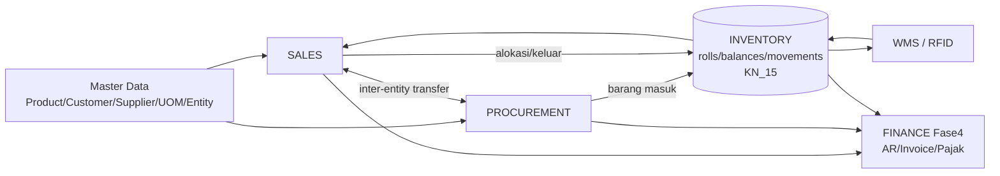

# KN_16 — END-TO-END PROCESS FLOWS, BLINDSPOT REGISTER & INFO-NEEDED
## Kain Nusantara Group — Cross-Module Business Process Blueprint (Deep Dive)

> **Status:** DRAFT v1 — Session #015 oleh E2 (Emergent), atas arahan user ("detailkan semua flow menyeluruh +
> identifikasi blindspot + info apa lagi yang dibutuhkan"). **BELUM ADA CODING.**
> **Induk:** `KN_14` (IA) · **Inventory model:** `KN_15` (roll/owner/lot/sourcing) · **Navigasi:** `KN_13`.
> **Tujuan:** menyatukan modul (Sales ⇄ Procurement ⇄ WMS/RFID ⇄ Finance) di atas model inventory KN_15,
> agar tidak ada konflik data / arah hilang / blindspot.
> **Aturan emas:** dokumen ≠ kode → **kode menang**, lalu dokumen diperbaiki.

---

## 0. Daftar Isi
| § | Isi |
|---|---|
| 1 | Peta modul & prinsip aliran data |
| 2 | **Flow SALES** end-to-end (multi-mode sourcing) |
| 3 | **Flow PROCUREMENT** end-to-end |
| 4 | **Flow WMS / RFID** end-to-end |
| 5 | **Flow INTER-ENTITY** (ringkas, detail di KN_15 §7) |
| 6 | Cross-Dock & Drop-Ship (overlay) |
| 7 | Peta transisi status inventory lintas-flow |
| 8 | Finance touchpoints (Fase 4 hooks) |
| 9 | **BLINDSPOT / GAP REGISTER** (yang belum teridentifikasi) |
| 10 | **INFO-NEEDED REGISTER** (yang saya butuhkan dari user) |
| 11 | Sinkronisasi ke KN_13 / KN_14 / KN_15 |
| 12 | Changelog |

---

## 1. Peta Modul & Prinsip Aliran Data



**Prinsip:**
1. **Inventory (KN_15) = pusat kebenaran stok** untuk semua modul. Tidak ada modul yang menyimpan stok sendiri.
2. **Owner (entitas) + lot + status** mengikuti barang di setiap flow.
3. Setiap perubahan stok = `inventory_movements` (append-only) + rebuild `inventory_balances`.
4. Semua transaksi **scoped `entity_id`**; master **SHARED** (KN_14 §7, revisi KN_15).

---

## 2. Flow SALES (End-to-End, Multi-Mode Sourcing)

```mermaid
graph TD
    Q[Quotation\n(opsional)] --> SO[Sales Order\nentity_id = entitas penjual]
    SO --> CHK{Cek pemenuhan\nper baris\n(KN_15 §6 alokasi)}
    CHK -->|stok sendiri cukup| RES[Reserve roll on-hand\nfrom_stock]
    CHK -->|stok sendiri kurang,\nentitas lain ada| IC[Inter-entity transfer\nB→E §5]
    CHK -->|belum on-hand,\nPO sudah ada| INC[from_incoming / ATP\npeg ke PO]
    CHK -->|perlu beli khusus| BTO[buy_to_order →\nPR ke Purchasing]
    CHK -->|SKU belum ada| SPC[special_order →\nMD buat produk + PR]
    CHK -->|langsung kirim| XD[cross_dock / drop_ship]
    RES --> APV{Approval\n(limit/role)}
    IC --> APV
    INC --> APV
    BTO --> APV
    SPC --> APV
    XD --> APV
    APV -->|approved| COM[committed]
    COM --> PICK[Pick & Cut\n(WMS, FEFO+lot)]
    PICK --> PACK[Pack / Staging]
    PACK --> DO[Surat Jalan / DO\nper entitas]
    DO --> SHIP[in_transit_sales]
    SHIP --> POD[POD diterima]
    POD --> INVC[Invoice + (PKP) Faktur Pajak]
    INVC --> PAY[Pembayaran / AR]
```

**Catatan tahap:**
- **Quotation:** DIPAKAI untuk B2B (Quotation → SO), dan **direct SO** untuk POS. SO punya field `channel`
  (pos | b2b | online). [RESOLVED S21]
- **DP / uang muka:** field `down_payment` di SO — **opsional per kasus** (tidak wajib). [RESOLVED S20]
- **Alokasi (KN_15 §6):** owner-aware + lot-aware + multi-mode; hasil punya `allocation_explanation` + bisa manual override.
- **Approval:** berdasarkan **matriks approval** (role/limit nominal per entitas). *(butuh info §10-I4)*
- **Pick & Cut:** pemotongan roll → `length_remaining` turun + remnant (BS).
- **Partial shipment:** boleh kirim sebagian → sisa jadi backorder. *(konfirmasi §10-I8)*
- **Invoice & Pajak:** entitas PKP terbit Faktur Pajak; non-PKP tidak. (Fase 4)
- **Retur:** SO → retur → disposisi **manual** (layak jual/BS/scrap) + credit note (Fase 4).

**Status SO (usulan, perluasan):**
`draft → quotation → confirmed → waiting_stock(backorder) | waiting_procurement | waiting_intercompany →
approved/committed → picking → packed → shipped(in_transit_sales) → delivered → invoiced → paid | cancelled | returned`

---

## 3. Flow PROCUREMENT (End-to-End)

```mermaid
graph TD
    NEED{Sumber kebutuhan} -->|replenishment\n(min/max, ROP)| PR[Purchase Requisition]
    NEED -->|buy_to_order / special\n(earmarked SO)| PR
    PR --> APV{Approval beli\n(limit/role)}
    APV -->|approved| PO[Purchase Order\nentity_id = entitas pembeli]
    PO --> SENT[Dikirim ke Supplier\non_order]
    SENT --> TRANSIT[Supplier kirim\nin_transit_inbound]
    TRANSIT --> RCV{Penerimaan}
    RCV -->|normal| GRN[Goods Receipt\nbuat inventory_rolls\nowner=entitas pembeli]
    RCV -->|earmarked + langsung kirim| XDOCK[cross_dock → outbound]
    RCV -->|drop-ship| DSHIP[langsung ke customer]
    GRN --> QC{QC?}
    QC -->|hold| QUAR[quarantine]
    QC -->|pass| PUT[Putaway ke bin\n(+RFID tag, Fase 5)]
    QUAR --> PUT
    PUT --> AVL[available]
    GRN --> APINV[AP Invoice + landed cost\n(Fase 4) → unit_cost/HPP]
```

**Catatan:**
- **Sumber kebutuhan:** (a) replenishment (min/max / reorder point per produk×gudang×entitas), (b) dedicated/earmarked dari SO.
- **PO `entity_id` = entitas pembeli** → roll hasil terima `owner_entity_id` = entitas itu.
- **Receiving catch-weight:** panjang aktual roll diukur saat terima (bisa ≠ PO). Toleransi over/under. *(info §10-I9)*
- **Cross-dock/drop-ship:** earmarked → bypass putaway (KN_15 §7B).
- **QC/quarantine:** opsional sebelum available.
- **Landed cost (impor):** ADA — freight+duty+asuransi dikapitalisasi ke `unit_cost`/HPP (Fase 4). **Mata uang IDR saja** (no valas). [RESOLVED S18]. *(toleransi over/under: info §10-I9)*
- **Retur beli (ke supplier):** kebalikan GRN (kurangi roll, debit note). *(blindspot §9-G12)*
- **Konsinyasi supplier (barang titipan):** owner = supplier sampai terjual? → model ownership khusus. *(blindspot §9-G1)*

---

## 4. Flow WMS / RFID (End-to-End)

```mermaid
graph TD
    REC[Receiving] --> LABEL[Generate label + RFID tag\nper roll (barang DISIMPAN)]
    LABEL --> PUT[Putaway\n(strategi bin: fixed/chaotic/by-lot)]
    PUT --> AVL[available di bin]
    AVL --> PICKL[Pick List dari SO\n(FEFO + lot-constraint dari alokasi)]
    PICKL --> CUT[Cut/Potong\nremnant→BS]
    CUT --> STG[Staging/Pack]
    STG --> GATE[Gate-out\nRFID read = validasi]
    AVL --> CC[Cycle Count / Opname\nper owner×lot]
    AVL --> XFER[Transfer antar gudang\n(pick→ship→receive)]
    CC --> ADJ[Adjustment\n(movement + alasan)]
```

**Catatan:**
- **RFID hanya untuk barang DISIMPAN** (putaway). Cross-dock/drop-ship/in-transit = `tracking_mode=document` (KN_15 §7B).
- **Lokasi:** Zone → Rack → [Level] → Bin (RFID-ready). Kapasitas bin? strategi putaway? *(info §10-I11)*
- **Pick:** mengikuti alokasi dari Sales (lot & roll yang sudah dipeg) — bukan pilih bebas.
- **Cycle count di gudang shared:** rekonsiliasi **per owner per lot** (variansi owner-aware) → adjustment.
- **Gate RFID (Fase 5):** read saat keluar/masuk = kontrol hijau/merah. Middleware on-prem + simulator (dev).
- **Transfer:** intra-entitas (owner tetap) vs inter-entitas (owner pindah, KN_15 §5/§7).

---

## 5. Flow INTER-ENTITY (ringkas)
Detail di **KN_15 §7**. Inti: entitas E kurang stok → Fulfillment Assistant usul transfer dari entitas B →
B approve → `ownership_transfer` (owner pindah saat **approval/dispatch**, S3) → (bila beda gudang) pindah fisik →
(Fase 4) AR/AP antar-entitas + eliminasi konsolidasi. Roll partial/split diizinkan (S7). Status SO `waiting_intercompany` (S5).

---

## 6. Cross-Dock & Drop-Ship (Overlay) — keputusan user
- **Cross-dock:** barang earmarked masuk → **langsung kirim**, TANPA scan terima / putaway / RFID (S14 — cukup status dokumen).
  Roll: `in_transit_inbound → cross_dock → in_transit_sales → sold`. `tracking_mode=document`, `location_type=cross_dock`.
- **Drop-ship:** supplier kirim langsung ke customer; barang tak pernah di gudang. **Surat Jalan tetap diterbitkan KITA**
  (atas nama entitas penjual, S15). Roll virtual `location_type=drop_ship`, `tracking_mode=document`.
- **Buy-to-order batal/lebih → AUTO fallback** jadi stok biasa (putaway → available) (S16).

---

## 7. Peta Transisi Status Inventory Lintas-Flow
| Dari | Ke | Pemicu (modul) |
|---|---|---|
| — | `on_order` | PO dibuat (Procurement) |
| `on_order` | `in_transit_inbound` | Supplier kirim (Procurement) |
| `in_transit_inbound` | `receiving`→`available` | Goods Receipt + Putaway (WMS) |
| `in_transit_inbound` | `cross_dock`→`in_transit_sales` | Earmarked cross-dock (Sales+Proc) |
| `available` | `reserved` | SO reserve (Sales) |
| `reserved` | `committed` | Approval SO (Sales) |
| `committed` | `picked`→`packed` | Pick & Pack (WMS) |
| `packed` | `in_transit_sales` | Dispatch / Surat Jalan (Sales+WMS) |
| `in_transit_sales` | `sold` | POD diterima (Sales→Finance) |
| `in_transit_sales` | `returned` | Retur customer (Sales) |
| `available` | `in_transit_transfer`/`_intercompany` | Transfer (WMS/Inter-entity) |
| `available` | `quarantine`/`blocked`/`damaged` | QC/Hold/Kerusakan (WMS) |
| `returned` | `available`/`damaged`/`scrapped` | Disposisi manual (Sales/WMS) |

---

## 8. Finance Touchpoints (Fase 4 — dirancang sekarang, diimplementasi nanti)
- **unit_cost/HPP** per roll/lot (D4): weighted-avg/FIFO **per owner**. COGS saat `sold`.
- **Goods-in-transit:** `in_transit_inbound` = aset pembeli; `in_transit_sales` = masih aset penjual s/d title pindah (POD).
- **Inter-entity:** transfer price → revenue B / persediaan E + AR/AP antar-entitas + **eliminasi** saat konsolidasi.
- **Pajak:** PKP (PT KSC) terbit Faktur Pajak/PPN keluaran; non-PKP (CV Kanda) tidak. e-Faktur? *(info §10-I6)*
- **Landed cost** (impor) kapitalisasi ke HPP.
- **DP/uang muka** untuk dedicated/special order? *(blindspot §9-G6)*
- **COA per entitas, jurnal/GL, AR/AP aging, kas/bank per entitas** (KN_14 roadmap Fase 4).

---

## 8B. Tambahan Sales/Finance & Strategi Master Data (Session #015 lanjutan)

### 8B.1 Eskalasi Alokasi ke Admin
Selain Sales konfirmasi sendiri (S1), Sales BISA **eskalasi ke Admin/Manager** untuk alokasi sensitif
(mixed-lot besar, override owner via inter-entity, special handling). Mode `assisted` → klik "Eskalasi" →
notifikasi Admin → Admin putuskan/override (teraudit). Status order: `waiting_allocation_approval`. [S22]

### 8B.2 Entitas Dinamis (fleksibel tambah)
- `business_entities` SUDAH dinamis (Admin → Entities). **Prinsip:** TIDAK hardcode entity_id; semua via DB +
  Entity Switcher. PRIMARY_ENTITY_ID hanya default seed. Entitas baru → otomatis muncul di switcher/scoping/owner. [S23]

### 8B.3 Multi-Rekening Bank per Entitas + Pemilihan di SO
> Info user: rekening beda untuk **PPN vs non-PPN**; **satu entitas multi-rekening**; saat SO pilih rekening tujuan.
- **Koleksi baru `bank_accounts`** (prefix `bank_`): {entity_id, bank_name, account_no, account_name, branch,
  designation: ppn|non_ppn|both, is_active, is_default}.
- **SO** + field `destination_bank_account_id` (dipilih saat buat SO; default = is_default sesuai tax mode entitas).
- **Invoice** tampilkan rekening terpilih; rekonsiliasi (Fase 4) cocokkan mutasi ke rekening ini.
- Aturan: invoice PPN → rekening ppn/both; non-PPN → non_ppn/both. [S24]

### 8B.4 Special Order (SKU belum ada) — detail flow
> Barang BELUM ada di katalog (custom / belum pernah dibeli). Koleksi `special_orders` (prefix `sord_`).
```
1. Sales buat Special Order (deskripsi, spesifikasi, qty, target harga, customer).
2. Routing ke MD (Merchandiser): buat/aktifkan PRODUCT di katalog (atau non-stock custom).
3. Routing ke Purchasing: PR → PO ke supplier (earmarked_for_order_id = sord_).
4. Barang datang → cross_dock (langsung kirim) ATAU putaway.
5. Special Order dikonversi/lanjut jadi fulfillment SO.
Status: draft → md_review → product_created → procurement → in_transit → ready → fulfilled | cancelled
```
- Beda dari buy_to_order biasa: special_order BUTUH pembuatan master produk dulu (SKU belum ada).
- DP opsional (S20) relevan di sini (mitigasi risiko batal). [S25]

### 8B.5 Special Price (harga custom negosiasi — BUKAN diskon) — flow BARU
> Info user: bukan diskon %; harga custom hasil nego; Sales request → approve Finance/Admin → WAJIB lampirkan
> bukti approval atasan. **Pakai koleksi PLANNED yang sudah ada: `price_approvals` (prefix `pra_`)** — JANGAN buat
> koleksi baru (anti-drift; sesuai ENTITY_REGISTRY Fase 1).
```
price_approvals (pra_): {customer_id, product_id, list_price, requested_price, qty_min?, reason,
  requested_by(sales), approval_evidence_url (UPLOAD bukti atasan), status: pending|approved|rejected,
  approver(finance/admin), approved_at, valid_until, scope: customer|customer_product, linked_order_id?, entity_id}
Flow:
1. Sales ajukan special price (customer + produk + harga nego + alasan) + UPLOAD bukti approval atasan.
2. Status pending → notifikasi Finance/Admin.
3. Finance/Admin review (lihat bukti) → approve / reject (teraudit).
4. Approved → harga custom AKTIF (customer/produk, s/d valid_until) → otomatis terpakai di SO.
5. SO yang pakai special price cantumkan ref pra_ + harga custom (bukan list price).
```
- Butuh **object storage** untuk upload bukti (integration nanti).
- Beda dari diskon: diskon = % off list (line/order); special price = harga absolut hasil nego, ber-approval & ber-bukti.
- Catatan: harga per-customer non-nego (price list/tier) → pakai `customer_price_lists` (cpl_). [S26]

### 8B.6 Strategi Master Data (Smart-Search / Recommender / AI-ready)
> Info user: simpan metadata LENGKAP (spesifikasi, deskripsi, dll) agar siap smart search + recommender + AI.
**Rekomendasi (anti-konflik data): SATU SSOT `products`, banyak VIEW — BUKAN tabel terpisah Sales vs Inventory.**
- Satu `products` = kebenaran. Sales & Inventory = **proyeksi/view** berbeda dari data sama:
  - **Sales view** (marketing/search): name, description, specifications{}, tags[], media[], color/motif,
    price, search_keywords[], badges.
  - **Inventory view** (operasional): sku, gramasi, lebar, base_unit, uom_conversions, grade, lot/roll, lokasi, stock buckets (KN_15).
- **Kenapa bukan tabel terpisah:** cegah data ganda/konflik (1 produk = 1 kebenaran). Cukup beda field + endpoint
  proyeksi (mis. `GET /products?view=sales` vs `?view=inventory`).
- **Field metadata DISIAPKAN sekarang (diisi bertahap):**
  ```
  description (long), specifications {komposisi, lebar, gramasi, perawatan, asal, ...},
  tags[], media[{type,url}], search_keywords[], attributes{} (facet/filter),
  ai_meta { embedding:[], recommender_tags:[], updated_at }   ← DISIAPKAN kosong (smart-search/AI)
  ```
- **Smart search / recommender / AI = MASA DEPAN:** struktur disiapkan; engine dibangun belakangan. **Tidak ada coding AI sekarang.** [S27]

### 8B.7 Reserved Logic — STATUS
- ✅ **SUDAH ADA** (level balance, `inventory_service.py`): `allocate_stock` (rencana per gudang by city priority),
  `atomic_reserve` (find_one_and_update, anti double-booking), `rollback_reservations`,
  `expire_old_reservations` (auto-release > 3 hari → SO `expired` + audit). SO punya `reservation_expires_at`.
- 🔜 **DI-UPGRADE** (KN_15): reservasi → level **ROLL** + **owner-aware** + **lot-aware**; expiry & rollback ikut roll.

---

## 9. BLINDSPOT / GAP REGISTER

> Status: 🟥 perlu KEPUTUSAN/INFO · 🟨 ada arah, perlu konfirmasi · 🟩 sudah tercakup (referensi).
> Status: 🟥 perlu KEPUTUSAN/INFO · 🟨 ada arah, perlu konfirmasi · 🟩 sudah tercakup (referensi).

```
G1  🟩 KONSINYASI: field DISIAPKAN (roll.ownership_type: internal|supplier_consignment|reseller_consignment +
        consignor_ref) namun DEFAULT internal/OFF (belum ada flow aktif v1). [RESOLVED S17]
G2  🟨 PRICING: price list per produk? per tier customer? beda harga per entitas? diskon line/order? promo?
        PPN included/excluded? (butuh info I5)
G3  🟨 UNIT & CATCH-WEIGHT BILLING: dijual per meter saja atau juga per kg (gramasi)? konversi UOM? (info I3)
G4  🟨 LOT GENEALOGY / TRACEABILITY: lacak lot supplier→lot kita→customer (kemampuan recall)? perlu/tidak.
G5  🟨 REORDER/REPLENISHMENT: min/max/ROP per produk×gudang×entitas? auto-PR? (info I9)
G6  🟩 DP/UANG MUKA: OPSIONAL per kasus (field down_payment di SO; tidak wajib). [RESOLVED S20]
G7  🟨 BACKORDER ALLOCATION: saat barang incoming tiba & ada >1 backorder rebutan → urutan alokasi (FIFO/prioritas)?
G8  🟨 SAMPLE/POTONG CONTOH: pengambilan sampel gratis (kurangi stok) — perlu di-track?
G9  🟨 GRADE RECLASS: roll grade A→B karena cacat ditemukan kemudian (movement reclass)?
G10 🟩 STOCK IN TRANSFER & TRANSIT visibility → tercakup KN_15 §3.4 (in_transit_transfer/_intercompany/_inbound/_sales).
G11 🟩 STOK VISIBLE TANPA RFID (cross-dock/drop-ship/document) → tercakup KN_15 §7B.
G12 🟨 RETUR BELI ke supplier (debit note + kurangi roll) — flow & dampak buku.
G13 🟩 MATA UANG: IDR SAJA (no multi-currency). Impor DIPERBOLEHKAN dengan landed cost (freight/duty)
        dikapitalisasi ke unit_cost/HPP (Fase 4). [RESOLVED S18]
G14 🟨 RBAC granular per entitas per modul (siapa lihat/aksi stok entitas lain)? matriks akses.
G15 🟨 DOC NUMBERING: doc_prefix per entitas × per tipe dokumen × reset per tahun fiskal — format?
G16 🟩 DATA MIGRATION: TIDAK ADA — mulai dari nol (seed demo). Importer tidak diperlukan v1. [RESOLVED S19]
G17 🟨 FREIGHT/ONGKIR: siapa tanggung (in/out), masuk invoice? FOB/CIF?
G18 🟨 PROJECT/LOT HOLD: customer kunci 1 lot utk proyek (pengiriman bertahap lintas waktu)?
G19 🟨 CYCLE COUNT/OPNAME: frekuensi & metode (full/partial/ABC) di gudang shared per owner.
G20 🟨 RETURN→LOT INTEGRITY: barang retur masuk lagi sebagai lot asal? atau lot "retur"?
G21 🟥 RFID HARDWARE & MIDDLEWARE: vendor/protokol (LLRP/MQTT/SDK)? printer tag? (Fase 5; simulator dulu)
G22 🟨 APPROVAL MATRIX: limit nominal & role per entitas utk SO/PO/transfer/discount. (info I4)
G23 🟨 NOTIFIKASI/ESKALASI tambahan utk flow baru (backorder ready, transfer approval, cross-dock arrival).
G24 🟨 PARTIAL INVOICE: invoice per pengiriman (partial) atau sekaligus?
G25 🟥 PT/CV ENTITAS: daftar final entitas legal + status PKP + kalender fiskal + doc_prefix. (info I1)
```

---

## 10. INFO-NEEDED REGISTER (yang saya butuhkan dari user)
> Untuk membangun tanpa "arah hilang". Tidak harus dijawab sekaligus — prioritas I1–I6 paling fondasional.
> **UPDATE Session #016 — I1–I6 RESOLVED (jawaban user): PRINSIP UTAMA = SEMUA CONFIGURABLE, TIDAK ADA HARDCODE.**

```
I1  🟩 ENTITAS LEGAL [RESOLVED]: CONFIGURABLE — entitas, status PKP/PPN, doc_prefix, kalender fiskal
       TIDAK di-hardcode; dikelola via business_entities + system_settings. Seed awal: ent_ksc (PT KSC, PKP),
       ent_kanda (CV Kanda, non-PKP) — bisa ditambah/diubah dari Admin.
I2  🟩 PRODUK [RESOLVED]: katalog SHARED semua entitas. TAMBAH spesifikasi: lebar (width_cm), gramasi (gsm),
       komposisi/serat (composition) + atribut custom fleksibel.
I3  🟩 UOM & PENJUALAN [RESOLVED]: SIAPKAN SEMUA jenis unit (meter, kg, roll, yard) + ENGINE KONVERSI
       (faktor konversi antar unit, mis. meter↔kg via gramasi) + minimum potong. Configurable.
I4  🟩 ORG & APPROVAL [RESOLVED]: matriks approval CONFIGURABLE (menyesuaikan flow) — per entitas, per jenis
       dokumen (SO/PO/transfer/diskon), threshold nominal → role. Engine evaluasi rule (collection approval_rules).
I5  🟩 PRICING & PAJAK [RESOLVED]: harga GLOBAL (1 price list). PPN 11% EXCLUDED (ditambah saat invoice).
       Diskon: per-item & per-order & dengan approval (semua). e-Faktur DIPERLUKAN. Semua configurable via settings.
I6  🟩 PEMBAYARAN [RESOLVED]: SEMUA term (tunai/POS, kredit/tempo NET-X, DP%, bertahap/installment) —
       CONFIGURABLE via payment_terms + customer.payment_profile (credit limit/block).
I7  SALES: pakai tahap Quotation? channel (POS walk-in / B2B / online)?
I8  PENGIRIMAN: boleh partial shipment? partial invoice? siapa tanggung ongkir (FOB/CIF)?
I9  PROCUREMENT: replenishment min/max/ROP? toleransi over/under receipt (catch-weight)? lead time supplier?
I10 🟩 IMPOR: ADA, dengan landed cost (freight/duty → HPP). Mata uang IDR SAJA (no valas). [RESOLVED]
I11 GUDANG: jumlah gudang & struktur lokasi (zone/rack/level/bin), strategi putaway/pick.
I12 KONSINYASI: field disiapkan, default OFF. [RESOLVED — aktivasi nanti bila perlu]
I13 🟩 MIGRASI: TIDAK ADA — mulai seed demo. [RESOLVED]
I14 RFID (Fase 5): vendor/hardware/printer & protokol? (atau mulai dengan simulator dulu)
I15 PELAPORAN: laporan prioritas (stok per entitas, valuasi, AR aging, penjualan, dead stock, konsolidasi)?
```

---

## 11. Sinkronisasi ke KN_13 / KN_14 / KN_15
- **KN_15** (inventory ownership/lot/sourcing) = fondasi data flow ini. **Tidak ada konflik**: KN_16 hanya merangkai
  flow di atas model KN_15.
- **KN_14** (IA): flow ini mengonfirmasi master SHARED + transaksi scoped. Tambah status SO/PO baru → akan
  direfleksikan saat lock.
- **KN_13** (navigasi): menu/halaman baru (Fulfillment Assistant, Inventory Status Board, Special Order,
  Backorder, Inter-Entity Transfer) perlu dipetakan saat implementasi (hindari nav drift).
- **Belum ada coding.** Dokumen ini = peta + register keputusan/info.

---

## 12. Changelog
### v1.2 — Session #015 (Sales/Finance tambahan + Master Data strategy)
- §8B baru: eskalasi alokasi ke Admin [S22]; entitas dinamis (no hardcode) [S23]; multi-rekening `bank_accounts`
  + SO.destination_bank_account_id [S24]; Special Order detail (sord_) [S25]; **Special Price = pakai
  `price_approvals` (pra_)** yang sudah planned (bukan koleksi baru) + upload bukti [S26]; strategi master data
  **SSOT tunggal + metadata smart-search/AI-ready** (Sales/Inventory = VIEW, bukan tabel terpisah) [S27].
- Reserved logic: KONFIRMASI sudah ada (balance-level) → akan di-upgrade ke roll-level (KN_15).
- Sinkron ENTITY_REGISTRY: products +metadata fields, bank_accounts diperkaya, prefix planned (pra_/sord_/bank_/cpl_).

### v1.1 — Session #015 (Decisions S17–S21)
- G1/I12 KONSINYASI: field disiapkan (ownership_type + consignor_ref), default internal/OFF.
- G13/I10 MATA UANG IDR saja; impor + landed cost → HPP (Fase 4).
- G16/I13 MIGRASI: tidak ada, mulai seed demo.
- G6 DP: opsional (field down_payment di SO). Quotation dipakai + direct SO (field channel pos|b2b|online).
- Roll +fields ownership_type, consignor_ref, location_type+consignment.

### v1 — Session #015
- Flow end-to-end Sales/Procurement/WMS-RFID + overlay cross-dock/drop-ship + inter-entity.
- Peta transisi status inventory lintas-flow + Finance touchpoints (Fase 4).
- **Blindspot/Gap Register (G1–G25)** + **Info-Needed Register (I1–I15)**.
- Menyerap keputusan user S14–S16 (cross-dock no-scan, drop-ship SJ oleh kita, buy-to-order batal→fallback stok).

---
*SSOT: KN_14 (IA) ⇄ KN_13 (nav) ⇄ ENTITY_REGISTRY (data) ⇄ KN_15 (inventory) ⇄ KN_16 (process flows). Code wins.*
